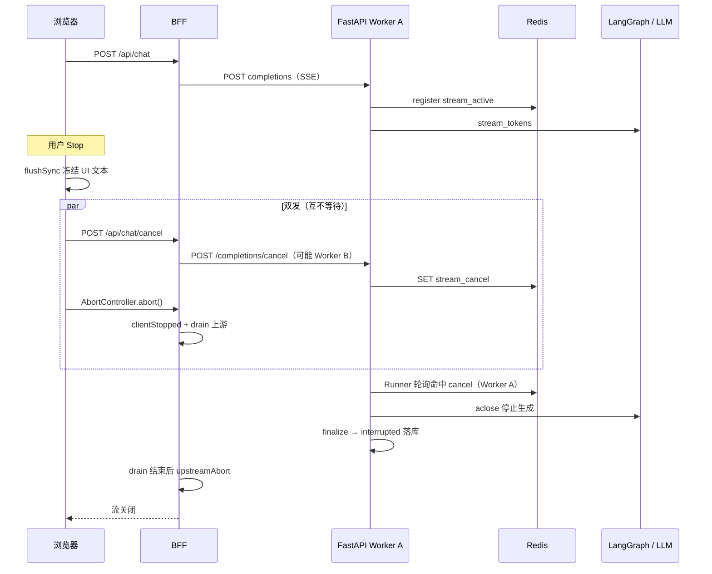
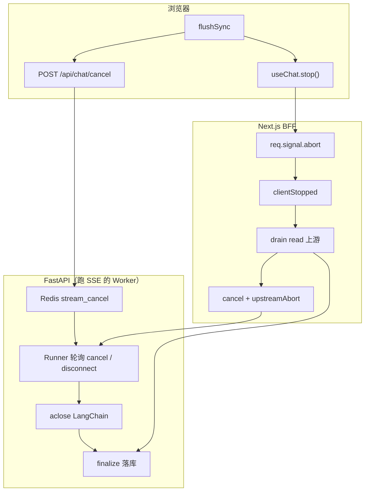

在 AI 流式聊天里，用户点 **停止生成**，表面往往只是一次 `AbortController.abort()`。在 **BFF + FastAPI SSE + LangGraph** 架构下，MemoryOS 落地的是 **「双发 abort」**：两套能力并行、各司其职。

<!--more-->

1. **AbortController**：断开浏览器 → BFF 的 fetch 流，UI 尽快停字  
2. **Cancel API**：`POST /api/chat/cancel` 写 Redis，让**正在跑这条流的那台 API Worker** 上的 Runner **尽最大努力**停掉 LLM 上游  

Wire 仍是 SSE（基于 fetch + ReadableStream），Stop 要同时解决 **UI、落库、成本、多实例** 四类问题，单链路 abort 覆盖不全。

## 一、只 abort fetch，为什么不够？

`AbortController` 只作用于**浏览器 → BFF 这一条 fetch**。它不会自动变成 Redis 里的 cancel 标记，也不会保证多实例部署下「处理 Cancel POST 的 Worker」把标记传到「正在跑 SSE 的 Worker」。

| 仅 abort 浏览器 fetch | 实际后果 |
| :--- | :--- |
| UI 停字 | BFF 收到 `req.signal`，`clientStopped` 后不再 enqueue，体验正常 |
| BFF **跳过 drain、立刻** abort 上游 | FastAPI SSE 被硬掐，`finalize` 来不及 commit，**刷新后 assistant 丢失** |
| 多 API Worker | abort 只断浏览器侧；若**不**写 Redis，Cancel 请求打到 B 实例时，A 实例上的 Runner 可能仍推理到 drain 结束 |
| LLM 供应商计费 | 下游断连 ≠ 100% 停费；行业普遍为 **best-effort** |

> **澄清**：LangGraph Runner 与这条 SSE 请求在**同一 API 进程**里跑；「跨实例」指的是 **Cancel HTTP 与 SSE 长连接可能落在不同 Worker**，靠 Redis 协调，而不是「abort 一次就全集群停」。

### AbortController.abort 与 ReadableStream.cancel

| API | 作用 |
| :--- | :--- |
| `AbortController.abort()` | 终止 fetch **整次请求**（含 `response.body` 的读取） |
| `reader.cancel()` | 取消**流读取端**；MemoryOS 在 drain 读完后调用，再 `upstreamAbort` |

BFF 顺序：**先 read 消费上游（不转发）→ reader.cancel → upstreamAbort**。说「cancel 保留 HTTP 连接」仅指**在调用 upstreamAbort 之前** BFF 仍连着 API；最终仍会 abort 上游 fetch。

## 二、双发 abort：分工与时序

两条链路 **并行**（Cancel 不阻塞 UI），前端对 Cancel 采用 fire-and-forget。



### 路径 A：AbortController（体验层）

`useChat.stop()` → abort 浏览器 → BFF 的 fetch → `req.signal`：

1. `clientStopped = true`：不再向浏览器转发 token  
2. **drainThenAbort**：继续 `reader.read()` 消费上游字节，**不写入**前端，以便 API 侧 `event_generator` 的 `finally` 仍有机会 **finalize**  
3. `reader.cancel()`，再 `upstreamAbort.abort()` 断 BFF → API  

drain 期间 BFF **仍连着 API**，Runner 不会仅因「浏览器已 abort」立刻停；因此 **Cancel API 与 abort 并行** 很重要：靠 Redis 让 Runner 在 drain 窗口内就开始停 LLM。

### 路径 B：Cancel API（协调层）

| 场景 | 为何需要 Cancel API |
| :--- | :--- |
| 多 API Worker | Cancel POST 与 SSE 可能不在同一进程，Redis 标记各 Worker 都能轮询到 |
| drain 窗口 | 浏览器已断，但 BFF→API 仍通；仅靠 `disconnect` 会晚于 cancel 标记 |
| 刷新 / 关 Tab | 可能来不及发 Cancel；走 API `Request.is_disconnected()`（见第五节） |

Cancel body 常用字段：

- `stream_id`：`X-Stream-Id` 响应头或 SSE `start` 帧（头优先；帧在弱网下可能晚到）  
- `visible_length` / `visible_content`（≤256 字符时可 inline 全文）：落库与 UI 对齐  

Runner 每 **250ms** 轮询 `disconnect | stream_cancel`（MemoryOS `_DISCONNECT_POLL_SECONDS = 0.25`）。

## 三、Stop 完整流程



### 前端 stop（与 MemoryOS 一致）

```ts
stop: () => {
  flushSync(() => { /* 冻结最后一条 assistant */ });

  void fetch("/api/chat/cancel", { /* stream_id + visible_* */ });

  useChatStop(); // 内置 AbortController，非递归调用自身
};
```

### BFF drainThenAbort（与 MemoryOS 一致）

```ts
req.signal.addEventListener("abort", () => {
  void drainUpstreamOnClientAbort?.();
});

async function drainThenAbort() {
  markClientStopped();
  try {
    while (true) {
      const { done } = await reader.read();
      if (done) break;
    }
  } catch { /* best-effort */ }
  await reader.cancel();
  options?.abortUpstream?.();
}
```

## 四、如何停 LLM？计费边界

| 层级 | 实现 | 能否停住 LLM 生成 | 计费 |
| :--- | :--- | :--- | :--- |
| 浏览器 abort | 断开展示侧 fetch | 否 | 否 |
| BFF drain / cancel | 消费或清本地缓冲 | 否（API 仍可能推） | 否 |
| Redis cancel + Runner | 轮询后 `aclose` | **best-effort 是** | 通常少计**后续** token |
| upstreamAbort | 断 BFF→API HTTP | 触发 disconnect 路径 | 间接 |

已生成的 token 多数厂商仍会计费；应用层目标是 **写 cancel、停止读流、关闭 async generator**。

## 五、缓冲：刷新、弱网、TTL

| 参数 | MemoryOS | 作用 |
| :--- | :--- | :--- |
| drain | 读完上游或连接结束 | 给 API `finalize` 时间；**不等于**「停 LLM」，停 LLM 靠 cancel 标记 |
| Redis TTL | **120s** | cancel / active 键过期；可酌情调短（如 ~30s），过短不利幂等与晚到 cancel |
| Runner 轮询 | **250ms** | Stop 体感上最多约 250ms 惯性 |

**刷新页面**：通常**不会**执行 Stop 里的 Cancel POST；API 在 Runner / 路由层检测 **`Request.is_disconnected()`**，按 disconnect 落库 `interrupted`（一般**无** `visible_length`，以服务端已 append 的 token 为准，可能比 UI 略多）。

**弱网一致性**：主动 Stop 时传 `visible_length`，`finalize` 截断为用户所见，避免「库比 UI 多字」。

## 六、落库规则

| 场景 | 落库内容 | status |
| :--- | :--- | :--- |
| Stop + `visible_length` | 可见前缀截断 | `interrupted` |
| Stop + 短文 `visible_content` | 完整可见原文 | `interrupted` |
| 正常结束 | 全文 | `complete` |
| Tab 关闭 / disconnect | 已 append 部分（无 visible 时） | `interrupted` |
| 无任何 token / tool | 不落库 | — |

## 七、踩坑复盘

| 现象 | 根因 | 对策 |
| :--- | :--- | :--- |
| Stop 后刷新丢消息 | 未 drain 就 upstreamAbort | drainThenAbort |
| Stop 后仍出字 | Cancel RTT + 250ms 轮询 + 管道缓冲 | flushSync + clientStopped |
| DB 字数多于 UI | cancel 到达前仍在 append | visible_length |
| 多 Tab 长连接多 | HTTP/1.1 同源连接数有限 | HTTP/2 / 控制并发；与「换 fetch」无直接等价关系 |

## 八、总结

| 问题 | 回答 |
| :--- | :--- |
| 为什么双发？ | abort：**UI + 停转发**；Cancel + Redis：**跨 Worker 停 Runner**（drain 期间尤其需要） |
| 为何不立刻掐上游？ | 先 drain + cancel 标记，保证 **finalize 落库** |
| 如何停 LLM？ | Redis cancel → Runner 轮询 → `aclose` →（随后）upstreamAbort |
| 缓冲怎么取？ | drain 不能省；Redis TTL 120s 可按产品调 |

**一句话**：Stop = **UI 快照 + Cancel 标记 + 停转发 + drain 落库 + 再断上游**。

## 相关

- 代码仓库：[JoeSmile/memoryOS](https://github.com/JoeSmile/memoryOS)（Stop / Cancel 设计见 [`docs/tech/chat-stream-cancel.md`](https://github.com/JoeSmile/memoryOS/blob/main/docs/tech/chat-stream-cancel.md)）
- 本站：[SSE 和 WebSocket 怎么选？](/sse-vs-websocket.html)
- [MDN：AbortController](https://developer.mozilla.org/en-US/docs/Web/API/AbortController)
- [MDN：ReadableStream.cancel](https://developer.mozilla.org/en-US/docs/Web/API/ReadableStream/cancel)
