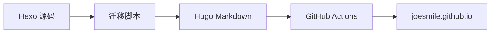
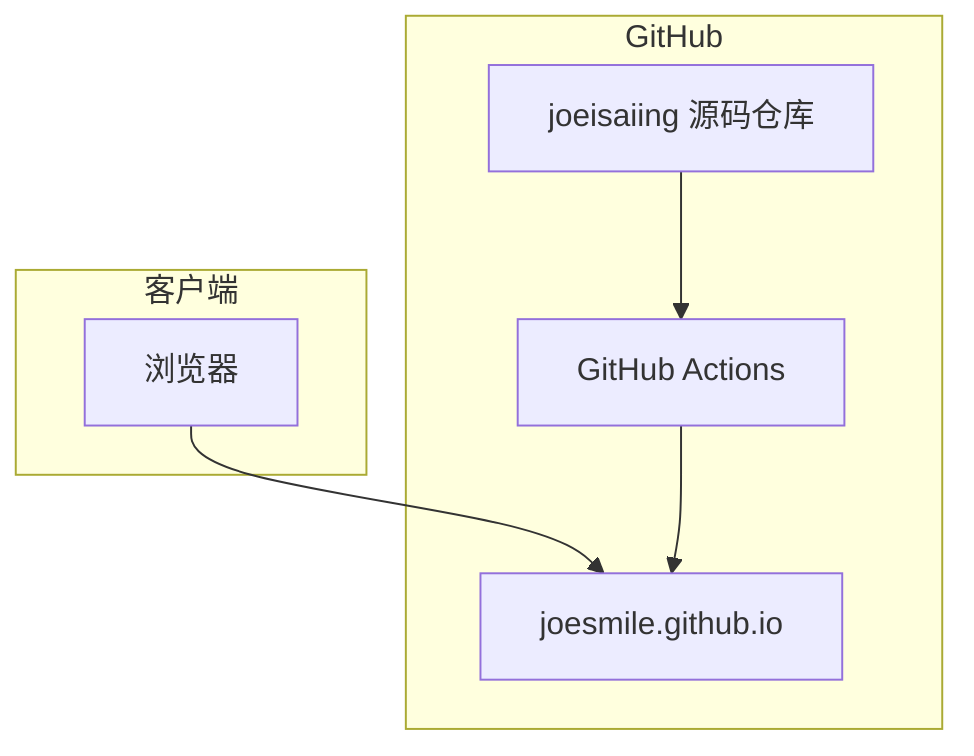

本站已从 Hexo 迁移至 Hugo + FixIt 主题，支持 Mermaid 图表。

## 流程图示例

```mermaid
flowchart LR
    A[Hexo 源码] --> B[迁移脚本]
    B --> C[Hugo Markdown]
    C --> D[GitHub Actions]
    D --> E[joesmile.github.io]
```

## 架构图示例

```mermaid
graph TB
    subgraph 客户端
        Browser[浏览器]
    end
    subgraph GitHub
        Source[joeisaiing 源码仓库]
        Pages[joesmile.github.io]
        Actions[GitHub Actions]
    end
    Browser --> Pages
    Source --> Actions
    Actions --> Pages
```

旧文章 URL 保持不变（如 `/koa-jwt.html`），外链无需修改。
