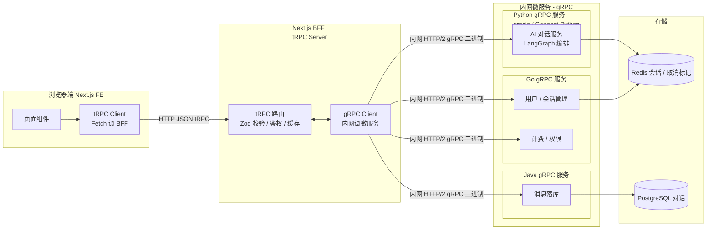
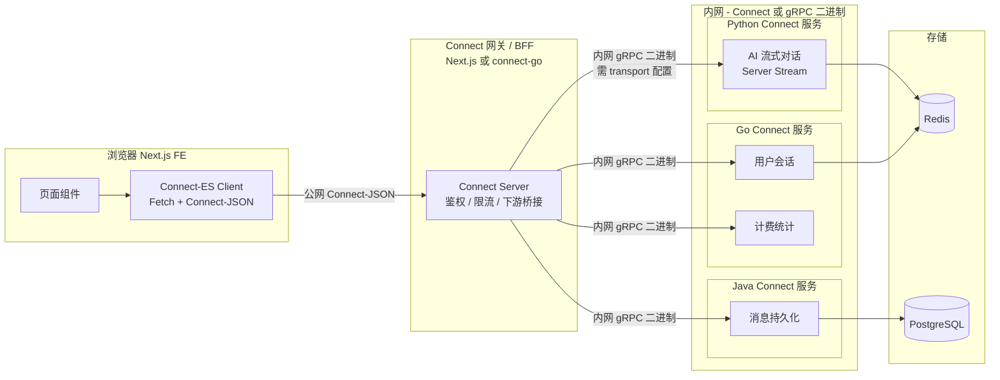

做全栈或 AI 应用时，**gRPC、tRPC、Connect-RPC** 名字常一起出现，但浏览器能不能直连、流式能支持几种、存量 gRPC 要不要改——边界很容易混。下文用对比表和两套架构图说明各自适合什么场景，并单独标出 **浏览器 Fetch 的流式能力上限**。

<!--more-->

# 一、gRPC / tRPC / Connect-RPC 核心技术对比表

## 核心维度横向对比

| 对比维度          | gRPC                                      | tRPC                                                                                                           | Connect-RPC                                                                  |
| ------------- | ----------------------------------------- | -------------------------------------------------------------------------------------------------------------- | ---------------------------------------------------------------------------- |
| **核心定位**      | 跨语言微服务的二进制 RPC 标准（Google）                 | TypeScript 全栈端到端 RPC，适合 Next.js / TS 同栈开发                                                                      | 兼容 gRPC 生态、浏览器与后端都能用的现代 RPC（Buf 团队）                                          |
| **接口定义（IDL）** | 必须用 Protobuf `.proto`                     | 不用 Protobuf，用 TypeScript + Zod / TypeBox 做类型校验                                                                 | 用标准 Protobuf `.proto`（与 gRPC 共用同一套 schema）                                   |
| **传输协议**      | HTTP/2 二进制为主；几乎离不开 HTTP/2                 | 普通 HTTP POST（JSON），走 HTTP/1.1 或 HTTP/2 均可                                                                      | HTTP/1.1 与 HTTP/2 都支持；wire 上可选 Connect 协议或 gRPC 二进制                          |
| **数据编码**      | Protocol Buffers 二进制                      | JSON（人类可读，无官方二进制 模式）                                                                                           | Connect-JSON 或 Protobuf 二进制（需在 transport 里配置）                                |
| **浏览器兼容性**    | 差：浏览器无法直接说原生 gRPC，通常要 grpc-web 或网关转一层     | 好：Fetch 直接调 BFF，和写 REST 差不多                                                                                    | 好：浏览器用 Fetch 直连 **Connect 服务端**；**不能**直连原生 gRPC-Go 等服务                       |
| **错误处理**      | 17 种固定 gRPC 状态码（0–16），错误多在 HTTP trailer 里 | 可自定义 TS 错误结构，也兼容 HTTP 状态码                                                                                      | 沿用 gRPC 状态码体系，Unary 时 HTTP 层也更易调试                                            |
| **流式能力**      | 服务端四流齐全：Unary / Client / Server / Bidi    | HTTP 下主要是 Unary + 服务端推送（Subscription、async generator 流式 query）；无 gRPC 式 client stream / bidi；复杂双向可组合 WebSocket | **服务端**四流齐全；**浏览器**侧成熟的是 Unary + Server Stream，Client / Bidi 受 Fetch 限制（见下表） |
| **全栈开发体验**    | 多语言各自生成代码；前端还要单独搞 grpc-web                | TS 前后端共享类型，基本零代码生成，Next.js 集成成熟                                                                                | `.proto` 一次生成多语言；前端 TS、后端 Go / Python / Java 类型对齐                            |
| **适用场景**      | 机房内网、多语言微服务互调                             | TS 全栈、Next.js BFF、LLM token 流式输出等「服务端往下推」场景                                                                    | 想统一 Protobuf IDL，且浏览器要走 Fetch + 可选 server stream                             |
| **性能**        | 内网 HTTP/2 + 二进制，吞吐和延迟通常最优                 | JSON 序列化，纯内网场景一般弱于 gRPC                                                                                        | 配二进制编码时接近 gRPC；JSON 模式与 tRPC 同属 JSON over HTTP，需实测对比                         |
| **依赖与侵入**     | 重：protoc、代码生成、HTTP/2 运维                   | 轻：主要是 TS 运行时，无额外编译链                                                                                            | 中等：Buf / protoc 生成代码；运行时库相对轻                                                 |
| **鉴权 / 元数据**  | HTTP/2 Header + gRPC Metadata             | 普通 HTTP Header / Cookie，和 Web 开发一致                                                                             | HTTP Header 传 Metadata，兼容 gRPC Metadata 习惯                                   |

### 流式能力补充：服务端 vs 浏览器（容易踩坑）

很多人对比时只看「协议支持四流」，忘了 **浏览器 Fetch 的能力边界**。简表如下：

| 流类型                   | gRPC（内网服务间） | Connect（服务端） | Connect（浏览器客户端）                 | tRPC（HTTP）                 |
| --------------------- | ----------- | ------------ | ------------------------------- | -------------------------- |
| Unary（一问一答）           | ✅           | ✅            | ✅                               | ✅                          |
| Server Stream（服务端持续推） | ✅           | ✅            | ✅（LLM 流式 token 够用）              | ✅（Subscription / 流式 query） |
| Client Stream（客户端持续发） | ✅           | ✅            | ⚠️ 实验性 / 浏览器支持不全                | ❌                          |
| Bidi（同时双向流）           | ✅           | ✅            | ❌ 非真双工（Fetch 暂无稳定的 full duplex） | ❌（可用 WebSocket 拼交互，语义不同）   |

> **一句话**：LLM 聊天「模型往下吐 token」= Server Stream，三种方案在浏览器里都能做；「浏览器和模型同时双向流式对话」在 2026 年仍不能指望 Connect / gRPC 在浏览器里原生搞定，通常要 WebSocket 或 BFF 中转。

## 场景选型总结

1. **内网多语言微服务互调（Go / Python / Java）** → **gRPC**
2. **Next.js + TS 同栈、BFF 聚合、LLM 服务端流式输出** → **tRPC**（或 tRPC BFF + 内网 gRPC，见架构 1）
3. **全链路共用一份 `.proto`、浏览器 Fetch 调 Connect 网关、内网服务间要完整四流** → **Connect-RPC**（见架构 2）

---

# 二、架构 1：Next.js（tRPC FE + BFF）+ 内网微服务（gRPC）

## 架构说明

1. **前端**：Next.js App Router / Pages Router，用 tRPC Client 调 BFF
2. **BFF**：Next.js API Route 上的 tRPC Server，负责鉴权、校验、聚合、限流
3. **BFF ↔ 微服务**：内网走 **gRPC**（Go / Python / Java 集群）
4. **存储**：业务服务下挂 Redis / DB

## 技术分层要点

1. **公网（浏览器 ↔ BFF）**：tRPC + JSON，类型前后端共享，前端迭代快
2. **内网（BFF ↔ 微服务）**：gRPC + HTTP/2 二进制，适合多语言、高吞吐
3. **隔离好处**：公网不暴露 gRPC；CORS、登录、限流集中在 BFF；内网专注性能

---

# 三、架构 2：Connect-RPC 统一 IDL（浏览器 + BFF + 内网）

## 架构说明

1. **浏览器**：Connect-ES Client，Fetch 调 **Connect 网关**（Connect-JSON，DevTools 可读）
2. **BFF / 网关**：Connect Server（Next.js 或 Go connect-go 均可），鉴权、限流；若下游是存量 gRPC，在此做协议桥接
3. **内网微服务**：connect-go / Connect-Python 等；客户端侧 **显式配置** gRPC 二进制模式（非自动切换）
4. **IDL**：全链路一份 `.proto`；wire format 可按链路配置（公网 JSON、内网二进制）

## 核心优势与前提（别误读）

1. **一份 `.proto` 贯穿全链路**：类型不割裂；但公网 JSON、内网二进制是 **配置选择**，不会根据「内网 / 公网」自动切换。
2. **浏览器调试友好**：Unary 和 Server Stream 用 JSON，curl / 网络面板能直接看。
3. **内网流式无短板**：服务之间 Client Stream / Bidi 都能用；**浏览器侧**仍以 Server Stream（如 LLM 吐字）为主。
4. **接存量 gRPC 的三种路**（不能简单说「浏览器直连老 gRPC」）：
  - 把服务迁到 **connect-go**（同时说 Connect、gRPC、gRPC-Web）
  - BFF 用 **Connect 客户端 + gRPC 协议模式** 调下游（服务端调用，不是浏览器）
  - 前面加 **Envoy Connect-gRPC Bridge** 等网关

> **基础设施提示**：Connect 的 streaming 往往需要端到端 HTTP/2；经 NGINX 代理 streaming 可能有问题，生产环境更常见 Envoy、HAProxy 等。

---

# 补充选型建议

1. **团队全 TS、主要是服务端往下推流（如 LLM token）、Next.js 快速交付** → **tRPC BFF + 内网 gRPC**（架构 1）
2. **多语言微服务、要强约束 Protobuf IDL、浏览器要 Fetch + server stream、内网要完整四流** → **Connect-RPC**（架构 2）；浏览器真双向流仍考虑 WebSocket
3. **纯内网、无浏览器、追求极致内网性能** → 全套 **gRPC**

---

## 参考

### 本站姊妹篇

- [分场景选型：tRPC / gRPC / Connect-RPC 与流式方案怎么落地](/rpc-scenario.html) — 按业务场景拆选型，强调浏览器 vs 服务端的流式边界
- [SSE 和 WebSocket 怎么选？](/sse-vs-websocket.html) — 浏览器流式传输层对比；EP02 选 SSE 而非 WebSocket 的产品与技术理由
- [AI 聊天 Stop 为什么要「双发 abort」？](/abort-controller.html) — Server Stream 场景下 Stop 不必 Bidi；AbortController + Cancel API 实践

### MemoryOS 项目技术方案（架构 1 落地参考）

实际栈为 **Next.js BFF + FastAPI SSE + LangGraph**，公网 HTTP 流式、内网可扩展 gRPC，与上文「tRPC BFF + 内网 gRPC」同属分层思路（MemoryOS 当前 BFF 为 Next Route + AI SDK，非 tRPC）。

| 文档 | 说明 |
| ---- | ---- |
| [EP02 流式对话史诗](https://github.com/JoeSmile/memoryOS/blob/main/docs/tasks/epics/EP02-streaming-chat.md) | 七阶段交付、SSE + LangGraph 总览 |
| [L02 流式对话 + LangGraph 学习笔记](https://github.com/JoeSmile/memoryOS/blob/main/docs/tasks/learning/L02-streaming-langgraph.md) | 聊天 UI、SSE 解析、`AbortController` 竞态 |
| [ep02-chat-sse 设计](https://github.com/JoeSmile/memoryOS/blob/main/openspec/changes/archive/2026-06-03-ep02-chat-sse/design.md) | 为何用 SSE 帧 + JSON、Non-Goals（本阶段不上 WebSocket） |
| [LangGraph 对话编排](https://github.com/JoeSmile/memoryOS/blob/main/docs/tech/langgraph-chat.md) | 图编排、`astream_events` → SSE `token` |
| [聊天 Stop / Cancel 技术方案](https://github.com/JoeSmile/memoryOS/blob/main/docs/tech/chat-stream-cancel.md) | BFF drain、Redis cancel、Runner 双检 |
| [聊天 RAG 流式协议与 BFF 升级](https://github.com/JoeSmile/memoryOS/blob/main/docs/tech/chat-rag-stream.md) | SSE → AI SDK Data Stream、`metadata.rag_sources` |
| [chat-sse OpenSpec 规格](https://github.com/JoeSmile/memoryOS/blob/main/openspec/specs/chat-sse/spec.md) | `POST /chat/completions` 事件类型与错误码 |

仓库入口：[JoeSmile/memoryOS](https://github.com/JoeSmile/memoryOS)

### 协议与框架官方文档

- [Connect RPC — FAQs](https://connectrpc.com/docs/faq)（浏览器 streaming、接存量 gRPC、NGINX 限制）
- [Connect for Web — Choosing a protocol](https://connectrpc.com/docs/web/choosing-a-protocol)（Connect vs gRPC-Web transport）
- [tRPC — Subscriptions](https://trpc.io/docs/server/subscriptions)（SSE / WebSocket 服务端推送）
- [gRPC — Status codes](https://grpc.io/docs/guides/status-codes/)（17 种 canonical codes）
- [Chrome Developers — Fetch streaming requests](https://developer.chrome.com/docs/capabilities/web-apis/fetch-streaming-requests)（`duplex: 'half'` 与浏览器限制）

