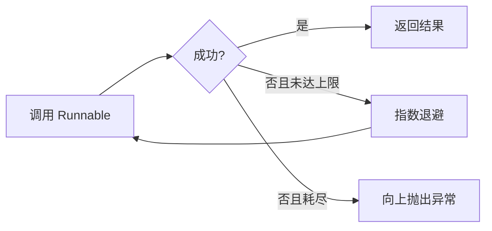
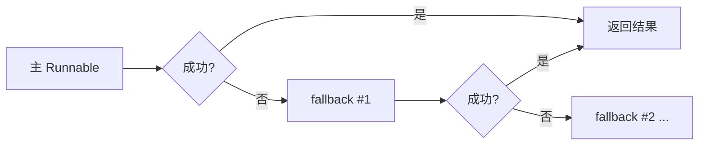
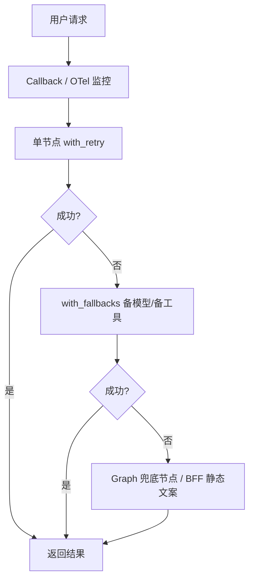

> **说明**：下文「重试 / 降级 / 兜底」三分法是**教学模型**，便于分层设计；各团队 Runbook 里的叫法可能不同。代码基于 LangChain Core **0.3.x** 的 `Runnable` API（`with_retry` / `with_fallbacks`）。

在企业级 RAG、Agent 系统上线后，大量线上故障往往来自**下游依赖**——第三方 API 超时、向量库连接抖动、工具调用异常、大模型限流……如果没有完善的重试、降级与兜底机制，单次依赖故障会直接传导到用户侧。

LangChain / LangGraph 提供了从**单 Runnable 重试**到**全图状态化兜底**的多层能力。本文梳理 5 套常用方案、一个常见 API 误区，并给出企业级组合架构与 MemoryOS 对照。

<!--more-->

## 一、核心概念：重试 / 降级 / 兜底

三者是层层递进的容错关系：

1. **重试（Retry）**：瞬时故障下自动再试，核心是「再试一次能不能成功」
2. **降级（Fallback）**：重试耗尽后切换备用 Runnable（备模型、备工具、简化检索），核心是「主路不通走辅路」
3. **兜底（Degrade / Fail-safe）**：动态方案全部失效，返回**预设静态安全结果**，核心是「宁可答不出，也不能崩溃或胡编」

| 层级 | 目标 | 典型场景 |
|------|------|----------|
| 重试 | 成功返回正常结果 | 网络超时、API 限流、连接抖动 |
| 降级 | 牺牲部分能力保核心可用 | 主模型不可用 → 备模型；SQL 失败 → 向量检索 |
| 兜底 | 服务不崩溃、答案可控 | 全依赖不可用 → 固定提示文案 |

### 常见误区：`a | b` 不是降级

LCEL 的 **`|` 是管道组合（pipe）**：`a` 的输出作为 `b` 的输入，**与是否异常无关**。

```python
# ❌ 错误理解：主模型失败会自动切备模型
safe_llm = main_llm | backup_llm  # 实际是 main 的输出 AIMessage 喂给 backup

# ✅ 正确：失败切换用 with_fallbacks
safe_llm = main_llm.with_fallbacks([backup_llm])
```

**降级容灾请用 `with_fallbacks()`**；`|` 只用于正常链式编排（`prompt | llm | parser`）。

---

## 二、五大方案全景对比

| 方案 | 核心能力 | 适用场景 | 复杂度 | 状态感知 | 生产推荐 |
|------|----------|----------|--------|----------|----------|
| `with_retry()` | 指数退避重试，可限定异常类型 | 单 LLM、单 Tool、易失败 RPC | 极低 | 无 | ⭐⭐⭐⭐ |
| `with_fallbacks()` | 主 Runnable 失败依次试备用 | 主备模型、主备工具、简化检索 | 极低 | 无 | ⭐⭐⭐⭐ |
| 手动 try/except | 完全自定义分支 | Demo、极短脚本 | 极低 | 无 | ⭐⭐⭐ |
| LangGraph 状态循环 | 计数、退避、独立兜底节点 | 多步 Agent、Self-RAG | 中等 | 有 | ⭐⭐⭐⭐⭐ |
| Callback 监控 | 埋点、告警、统计 | 全链路可观测（配合上述使用） | 中等 | 事件级 | ⭐⭐⭐⭐⭐ |

> 生产环境通常是**叠加**而非五选一：`Callback` + 单节点 `with_retry` + `with_fallbacks` + Graph 兜底节点。

---

## 三、方案逐解

### 方案一：`Runnable.with_retry()` — 单节点瞬时重试

#### 原理

基于 `tenacity`，给 Runnable 套重试策略。**只负责「同一逻辑多试几次」**，不负责切换备用链路（那是 `with_fallbacks`）。

官方建议：**retry 范围尽量小**——对 `model.with_retry()`，而不是整条 `chain.with_retry()`。

#### 流程



#### 代码

```python
from langchain_core.tools import tool
from langchain_openai import ChatOpenAI
from openai import RateLimitError

@tool
def finance_query(month: str) -> str:
    """查询指定月份财务报表"""
    raise TimeoutError("财务系统接口超时")

# 只对超时/连接类异常重试，参数名是 retry_if_exception_type
retry_tool = finance_query.with_retry(
    stop_after_attempt=3,
    wait_exponential_jitter=True,
    retry_if_exception_type=(TimeoutError, ConnectionError),
)

llm = ChatOpenAI(model="gpt-4o-mini").with_retry(
    stop_after_attempt=2,
    retry_if_exception_type=(RateLimitError,),
)
```

重试耗尽后仍会**抛异常**；若要静态文案，接 `with_fallbacks`（见方案二）。

---

### 方案二：`with_fallbacks()` — 主备切换（降级）

#### 原理

主 Runnable 失败时，**按顺序**尝试 `fallbacks` 列表中的备用 Runnable。

可与 `with_retry` 链式组合：**先重试主路，再切辅路**。

#### 流程



#### 代码

```python
from langchain_core.runnables import RunnableLambda
from langchain_openai import ChatOpenAI
from openai import RateLimitError

main_llm = ChatOpenAI(model="gpt-4o", temperature=0)
backup_llm = ChatOpenAI(model="gpt-4o-mini", temperature=0)

# 主模型：限流重试 2 次 → 仍失败则切备模型
safe_llm = main_llm.with_retry(
    stop_after_attempt=2,
    retry_if_exception_type=(RateLimitError,),
).with_fallbacks([backup_llm])

# 工具：重试后仍失败 → 返回静态安全文案（RunnableLambda 包装）
static_tool_fallback = RunnableLambda(
    lambda _: "【兜底】财务系统临时维护，请稍后查询或联系管理员"
)
safe_tool = finance_query.with_retry(
    stop_after_attempt=3,
    retry_if_exception_type=(TimeoutError, ConnectionError),
).with_fallbacks([static_tool_fallback])
```

#### 手动 try/except（备选）

灵活但易重复、难统一退避；**必须保证所有分支都有 return**，避免静默返回 `None`：

```python
from langchain_core.runnables import RunnableConfig, RunnableLambda

def invoke_tool_with_guard(tool_args: dict, config: RunnableConfig) -> str:
    try:
        return finance_query.invoke(tool_args, config=config)
    except TimeoutError:
        import time
        time.sleep(1)
        try:
            return finance_query.invoke(tool_args, config=config)
        except Exception as exc:
            return f"【系统提示】工具调用失败：{type(exc).__name__}，请稍后重试"
    except Exception as exc:
        return f"【系统提示】工具调用失败：{type(exc).__name__}，请稍后重试"

# LCEL 接入需 RunnableLambda，不能直接 | 裸函数
safe_invoke = RunnableLambda(invoke_tool_with_guard)
```

---

### 方案三：LangGraph 状态循环 — 复杂 Agent 首选

#### 原理

在 State 里维护 `retry_count`、错误信息；条件边决定**继续重试 / 成功结束 / 兜底节点**。

生产建议：

- 工具执行优先用官方 **`ToolNode`**（自动捕获异常、生成 `ToolMessage`）
- `graph.invoke(..., {"recursion_limit": 25})` 防止路由写错死循环
- 重试分支加**退避**（sleep 或异步 delay）

#### 代码（简化示意）

```python
import operator
import time
from typing import Annotated, TypedDict

from langgraph.graph import END, START, StateGraph

class AgentState(TypedDict):
    query: str
    retry_count: Annotated[int, operator.add]
    tool_result: str
    error_msg: str

MAX_RETRIES = 3

def tool_exec_node(state: AgentState):
    try:
        res = finance_query.invoke({"month": state["query"]})
        return {"tool_result": res, "error_msg": ""}
    except Exception as exc:
        return {"retry_count": 1, "tool_result": "", "error_msg": str(exc)}

def backoff_node(state: AgentState):
    # 指数退避，上限 8s
    time.sleep(min(2 ** max(state.get("retry_count", 1) - 1, 0), 8))
    return {}

def fallback_node(state: AgentState):
    return {
        "tool_result": (
            f"【兜底】连续 {state['retry_count']} 次调用失败，"
            "财务系统暂不可用，请稍后重试"
        )
    }

def retry_router(state: AgentState) -> str:
    if state.get("tool_result"):
        return "success"
    if state.get("retry_count", 0) < MAX_RETRIES:
        return "retry"
    return "fallback"

builder = StateGraph(AgentState)
builder.add_node("tool_exec", tool_exec_node)
builder.add_node("backoff", backoff_node)
builder.add_node("fallback", fallback_node)
builder.add_edge(START, "tool_exec")
builder.add_conditional_edges(
    "tool_exec",
    retry_router,
    {"success": END, "retry": "backoff", "fallback": "fallback"},
)
builder.add_edge("backoff", "tool_exec")
builder.add_edge("fallback", END)

graph = builder.compile()
result = graph.invoke(
    {"query": "2026-03", "retry_count": 0, "tool_result": "", "error_msg": ""},
    config={"recursion_limit": 25},
)
```

---

### 方案四：Callback — 全链路可观测

Callback **不做重试/兜底**，负责「看见故障」：日志、指标、告警。

```python
from langchain_core.callbacks import BaseCallbackHandler

class EnterpriseMonitorCallback(BaseCallbackHandler):
    def __init__(self):
        self.llm_error_count = 0
        self.tool_error_count = 0

    def on_llm_error(self, error: BaseException, **kwargs):
        self.llm_error_count += 1
        # 生产：写入 trace / Prometheus / 钉钉

    def on_tool_error(self, error: BaseException, **kwargs):
        self.tool_error_count += 1

    def on_chain_error(self, error: BaseException, **kwargs):
        pass

monitor = EnterpriseMonitorCallback()
safe_llm.invoke("...", config={"callbacks": [monitor]})
```

建议在 span 里记录：`attempt`、`fallback_used`、`degraded_mode`，而不只 print。

---

## 四、企业级四层组合架构



| 层级 | 机制 | 职责 |
|------|------|------|
| 观测 | Callback、OpenTelemetry | 失败率、重试次数、fallback 触发次数 |
| 瞬时重试 | `with_retry()` | 超时、限流、连接抖动 |
| 降级 | `with_fallbacks()` | 主模型 → 备模型；精查 → 模糊检索 |
| 终极兜底 | Graph 静态节点 / API 边界 | 固定安全文案，禁止编造 |

### 生产级模板

```python
monitor = EnterpriseMonitorCallback()
base_config = {"callbacks": [monitor]}

backup_search = RunnableLambda(lambda q: "【降级】仅返回缓存摘要…")

safe_tool = (
    finance_query.with_retry(
        stop_after_attempt=3,
        wait_exponential_jitter=True,
        retry_if_exception_type=(TimeoutError, ConnectionError),
    )
    .with_fallbacks([backup_search])
)

def agent_node(state):
    try:
        res = safe_tool.invoke(state["query"], config=base_config)
        return {"result": res}
    except Exception:
        # 最后一道：Graph 内静态兜底（或交给 BFF/SSE 错误帧）
        return {"result": "【系统提示】当前服务繁忙，请稍后再试"}
```

### MemoryOS Chat 对照（RAG / Agent 场景）

| 故障点 | 推荐策略 |
|--------|----------|
| Embed / 向量检索超时 | `with_retry` + 超时预算；连续失败短期熔断 |
| 主 collection 无结果 | 降级：放宽 top_k、换 BM25（若已接入） |
| Tavily / 外部搜索不可用 | `with_fallbacks` 关闭联网，仅 RAG + 记忆 |
| ToolNode 单工具失败 | ToolMessage 返回可读错误，LLM 修正重试（≤N 轮） |
| 全链路失败 | SSE 错误帧 + 静态文案，**不**把堆栈暴露给用户 |

与 [Agent Tool 备忘录](/agnet-tool.html)、[BFF 背压](/bff-stream-backpressure.html) 配合：Tool 层捕获异常、Graph 限轮次、BFF 做超时与断连。

---

## 五、落地避坑（8 条）

1. **`|` 是 pipe，不是 fallback** — 降级用 `with_fallbacks()`
2. **不要所有异常都重试** — 参数错误、权限不足应快速失败
3. **重试上限 2~3 次** — 配合**超时预算**，避免拖垮 TTFT
4. **指数退避 + jitter** — 防故障恢复时流量洪峰
5. **retry 范围尽量小** — `model.with_retry()` 优于 `chain.with_retry()`
6. **兜底文案业务审核** — 金融 / 法律场景宁可拒答不编造
7. **幂等性** — 可重试写操作必须幂等（订单、扣款）
8. **监控必备** — 统计 `fallback_used`、兜底触发率，阈值告警

---

## 六、总结

- **短链路**：`with_retry().with_fallbacks([...])` 通常够用
- **复杂 Agent**：LangGraph 状态机 + ToolNode + 兜底节点 + `recursion_limit`
- **任何生产系统**：Callback / OTel 与容错同上线
- **RAG 特有**：降级不仅是换小模型，还包括检索策略降级与「仅记忆/仅静态拒答」

容错没有银弹；按 SLA 与风险等级选层，在可靠性与研发成本之间取平衡即可。
