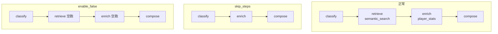

> 以 MemoryOS 世界杯 RAG 的 **`gossip`** workflow 为例，说明如何在 LangGraph Studio 里通过 **Manage Assistants** 跳过检索 / 球员统计，对比「正常跑」与「关 tool」时 Trace 的差异。

---

## 引言：为什么要 Skip Tool？

调试 RAG / 多步 workflow 时，你常常需要回答这类问题：

- **没有检索结果时**，compose 还会瞎编吗？
- **`player_stats` 关掉**，回答质量差多少？
- 某一步是不是 **多余** 的，可以整条链路砍掉吗？

如果每次改代码、注释掉 `semantic_search` 再重启 `langgraph dev`，迭代会很慢。  
LangGraph Studio 的做法是：在图里把 **tool 调用暴露成可配置项**，通过 **Assistant context** 在 UI 里开关——**生产 `POST /chat` 不受影响**。

本文用 **`gossip`** 图做练习（`step_classify_topic` → `step_retrieve_stories` → `step_enrich_player_context` → `step_compose_reply`），因为它在 Studio 里 **一步一个节点**，比 `simple_qa` 的单体 ReAct agent 更适合学 skip。

---

## 一、两种「Skip」：别搞混

| 方式 | Assistant 字段 | 效果 | 适用 |
| :--- | :--- | :--- | :--- |
| **Skip 整步** | `skip_steps: ["step_retrieve_stories"]` | 该节点 no-op，不写检索逻辑 | 模拟「完全没有这一步」 |
| **关 tool、步仍跑** | `enable_semantic_search: false` | 节点执行，但内部不调 `semantic_search` | 模拟「步还在，tool 被禁用」 |
| **关 tool、步仍跑** | `enable_player_stats: false` | 节点执行，但内部不调 `player_stats` | 同上，针对 enrich 步 |



**合法 `skip_steps` 节点名**（必须与代码里函数名一致）：

- `step_classify_topic`
- `step_retrieve_stories`
- `step_enrich_player_context`
- `step_compose_reply`（一般不要 skip，否则没有 `answer`）

---

## 二、Studio 里怎么配

### 2.1 前置

```bash
# worldcup-rag 仓库根目录
langgraph dev -c langgraph.json
```

Studio：`https://smith.langchain.com/studio/?baseUrl=http://127.0.0.1:2024`

1. 左上角选图 **`gossip`**
2. 左下角 **Manage Assistants**（或点某个节点上的齿轮）创建 / 编辑 Assistant

### 2.2 从节点进入配置（推荐学习路径）

在图里点 **`step_enrich_player_context`** 节点旁的齿轮，会打开该节点相关的 Assistant 配置面板：


面板里可以看到两类控件：

- **Skip Steps**：勾选要 no-op 的 gossip 节点（可 skip 多步）
- **Enable Player Stats**：`false` 时，本步 **跳过 `player_stats` 查询**（节点仍会执行）

保存后会生成 Assistant **新版本**（与 [Prompt 调试文章](/langsmith-test-different-prompts.html) 同一套版本机制）。

### 2.3 示例 Assistant 配置

**只关球员统计（Turn 2 实验）**：

```json
{
  "skip_steps": [],
  "enable_semantic_search": true,
  "enable_player_stats": false
}
```

**跳过检索，直接 compose**：

```json
{
  "skip_steps": ["step_retrieve_stories"],
  "enable_semantic_search": true,
  "enable_player_stats": true
}
```

**检索 + 统计都关**：

```json
{
  "skip_steps": [],
  "enable_semantic_search": false,
  "enable_player_stats": false
}
```

跑图前确认左下角选中的 **不是 Default**，而是你保存过的 Assistant。

---

## 三、Trace 对比：正常 vs Skip Tool

以 Input `{"query": "梅西世界杯表现怎么样"}` 为例。

### 3.1 正常流程（Enable Player Stats = true）

Turn 1 使用默认 Assistant，`step_enrich_player_context` 会调用 `player_stats`，Trace 里 **`metadata.player_context`** 出现梅西的 preview：


右侧 Thread 可展开：

```text
step_enrich_player_context
  └── metadata
        └── player_context
              └── 0
                    mention: 梅西
                    player_id: P-14758
                    preview: [Player Career] Lionel Messi · ...
```

同时 `tools_trace` 里会有 `player_stats`，对外 `tools_used` 可能包含 `player_stats`。

### 3.2 关闭 Player Stats（Enable = false）

Turn 2 换 Assistant，`enable_player_stats: false`：


此时 Trace 里：

| 字段 | 值 | 含义 |
| :--- | :--- | :--- |
| `studio_enable_player_stats` | `false` | Assistant 开关已生效 |
| `player_context` | `[]` | 本步未查 stats，且无残留卡片 |
| `player_mentions` | `["梅西"]` | **仍可能有值**——来自上一步 `step_classify_topic` 的文本抽取，不是 stats |

注意：**关 tool ≠ 关「提到球员名」**。`player_mentions` 是 classify 步从 query 里正则抽出来的；只有 `player_context` 才是 enrich 步查库后的结果。

对比两次 **compose 的 answer**，就能直观感受「没有 stats 上下文」时 LLM 表现差异。

---

## 四、常见坑：Thread 里的旧 state

若 **Turn 1** 开着 `enable_player_stats: true`，**Turn 2** 改成 `false`，却在 enrich 步仍看到旧的 `player_context`——**不是 LLM 缓存**，而是 **LangGraph Thread checkpoint** 把 Turn 1 的 `metadata` 带到了下一 run。

处理方式：

1. **改 Assistant 开关后开 New Thread**（做对比实验时最干净）
2. 代码侧：`enable_player_stats: false` 时应 **主动清空** `player_context`（worldcup-rag 已修复）

```python
if ctx.metadata.get("studio_enable_player_stats") is False:
    ctx.metadata["player_context"] = []
    return ctx
```

`enable_semantic_search: false` 时同理会写 `story_hits = []`；用 `skip_steps` 跳过 retrieve 时，也应 **赋值清空** 旧 hits，而不是 `setdefault`。

---

## 五、代码侧怎么接（简要）

Studio 能配这些字段，是因为 **`gossip` 图注册了 `GossipStudioContext`**：

```python
class GossipStudioContext(BaseModel):
    skip_steps: list[str] = Field(default_factory=list, ...)
    enable_semantic_search: bool = Field(default=True, ...)
    enable_player_stats: bool = Field(default=True, ...)
```

每个 gossip 节点包装为：

```text
Assistant context
    ↓
_run_gossip_step(state, runtime)
    ↓
skip_steps 命中? → apply_gossip_studio_skip（no-op + 默认值）
否则 → apply_gossip_studio_controls → step_fn（读 studio_enable_*）
```

生产路径 `gossip_workflow.run()` **不注入** `studio_enable_*`，行为与改 Studio 前一致。

更完整的 Prompt + Assistant 机制见：[LangGraph Studio 实战：用 Assistant 调试不同 System Prompt](/langsmith-test-different-prompts.html)。

---

## 六、学习实验建议

按下面顺序在 Studio 里跑同一 query，并 **每个实验新建 Thread**：

| # | Assistant 配置 | 观察 |
| :---: | :--- | :--- |
| 1 | 全默认 | baseline：`story_hits`、`player_context`、最终 answer |
| 2 | `enable_player_stats: false` | `player_context` 空，compose 是否仍合理 |
| 3 | `enable_semantic_search: false` | 无向量检索，answer 是否更「空」 |
| 4 | `skip_steps: ["step_retrieve_stories"]` | 与 3 对比：skip 步 vs 步内关 tool |
| 5 | `skip_steps: ["step_enrich_player_context"]` | compose 只有 story、无 stats |

跑完后在 LangSmith **Compare Runs** 或 Thread 时间线里并排看 `output.answer` 与 `metadata.tools_trace`。

---

## 七、FAQ

**Q：`simple_qa` 能在 Studio 里 skip tool 吗？**

A：当前 worldcup-rag 只在 **`gossip`** 接了 `GossipStudioContext`。`simple_qa` 是单个 ReAct `agent` 节点，要 skip tool 需另做 `enabled_tools` 列表或 Studio **Interrupts** 在 tool call 前人工拦截。

**Q：Skip Steps 和 Enable false 有什么区别？**

A：Skip 整步时，该步逻辑 **完全不执行**（包括 classify 里的关键词分析等）；Enable false 时步会跑，只是 **不调外部 tool**。

**Q：为什么 `player_mentions` 还在？**

A：它来自 **classify 步**对 query 的 mention 抽取，与 `player_stats` 无关。要没有 mentions，需 skip `step_classify_topic` 或换不含球员名的 query。

**Q：生产 API 会被 Studio 配置影响吗？**

A：不会。Assistant context 只在 `langgraph dev` / Studio Target 生效。

---

## 八、小结

| 步骤 | 动作 |
| :--- | :--- |
| 1 | Studio 选 **`gossip`** 图 |
| 2 | Manage Assistants / 节点齿轮 → 配 `skip_steps` 或 `enable_*` |
| 3 | 选中非 Default 的 Assistant，**New Thread** 跑 query |
| 4 | 对比 Trace 里 `story_hits`、`player_context`、`tools_trace` 与最终 answer |
| 5 | 调好行为再决定是否改生产代码 |

LangGraph Studio 的 skip tool，本质是把 **「这一步要不要调外部能力」** 从代码里抽成 **可版本化的运行时开关**——和 Prompt Assistant 是同一套学习路径，只是控的是 **tool / step** 而不是 **system prompt**。

---

**相关阅读**：[LangGraph Studio 实战：用 Assistant 调试不同 System Prompt](/langsmith-test-different-prompts.html) · [LangSmith Evaluator 实战](/langsmith-evaluator.html)
