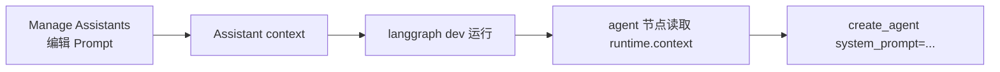

> 以 MemoryOS 世界杯 RAG 项目为例，说明如何在 LangGraph Studio 里通过 **Manage Assistants** 切换不同 System Prompt，而不必每次改代码、重启服务。

---

## 引言：为什么需要 Assistant 来调 Prompt？

在 Agent / RAG 项目里，System Prompt 往往是最影响回答质量的旋钮之一。常见痛点是：

- 改 `prompts.py` → 重启 `langgraph dev` → 手动跑一遍 → 再改 → 再重启，**迭代很慢**
- 线上 API 和生产 Prompt 绑死，**Studio 里试不出差异**
- 想对比 v1 / v2 两个 Prompt，只能开分支或注释代码，**不好并排对照**

LangGraph Studio 的 **Assistant** 机制，本质上是给同一张图挂一份 **可命名的运行时配置（context）**。你在 UI 里改 Prompt、保存版本、切换 Active，图的行为就会变——**代码不用动**。

本文走一遍完整链路：代码怎么改 → Studio 怎么配 → 怎么验证 → 底层怎么串起来。

---

## 一、先搞清三个概念

| 概念 | 是什么 | 本文例子 |
| :--- | :--- | :--- |
| **Graph（图）** | 节点 + 边的 workflow | `simple_qa`：normalize → agent → finalize |
| **Context（运行时上下文）** | 不进 graph state、每次 run 注入的配置 | `simple_qa_system_prompt` |
| **Assistant（助手配置）** | 某张图 + 一份 context + 版本历史 | `simple_qa_assistant` v1 / v2 / v3 |

一句话：**Graph 管流程，Assistant 管「这次跑用哪套 Prompt」**。



---

## 二、代码侧：让 Studio 能编辑 Prompt

只有注册了 `context_schema` 的图，Studio 才会在 **Manage Assistants** 里露出可编辑字段。我们以 `simple_qa` 为例（`worldcup_chat` 等图第一步尚未接入，Assistant 里 context 为空是正常的）。

### 2.1 定义 StudioContext

新建 `workflows/studio_context.py`，把 Prompt 声明成 Pydantic 字段，并打上 LangGraph 扩展元数据：

```python
from pydantic import BaseModel, Field
from prompts import SYSTEM_PROMPT

class StudioContext(BaseModel):
    simple_qa_system_prompt: str = Field(
        default=SYSTEM_PROMPT,
        description="System prompt for the simple_qa ReAct agent (Studio: Manage Assistants).",
        json_schema_extra={
            "langgraph_type": "prompt",      # Studio 渲染成 Prompt 编辑器
            "langgraph_nodes": ["agent"],    # 标注绑定到 agent 节点
        },
    )
```

要点：

- **`default=SYSTEM_PROMPT`**：新建 Assistant 时 UI 会预填与代码一致的默认 Prompt，不是空白
- **`langgraph_type: prompt`**：Studio 用专用编辑器展示，而不是普通 JSON 字符串
- **`langgraph_nodes: ["agent"]`**：UI 显示「Used in node: agent」，方便对照图结构

### 2.2 图编译时挂上 context_schema

在 `workflows/studio_graphs.py` 里，`simple_qa` 图这样编译：

```python
builder = StateGraph(
    StudioGraphState,
    context_schema=StudioContext,   # 关键：暴露给 Studio
)
builder.add_node("normalize_input", _normalize_simple_qa_input)
builder.add_node("agent", _run_simple_qa_agent)
```

`normalize_input` 会把 Studio 的 `query` + 可选 `history` 拼成 agent 消息，**规则与生产 `/chat` 共用** `build_simple_qa_messages()`（最近 5 轮 history）：

```python
def _normalize_simple_qa_input(state):
    ...
    return {
        "messages": build_simple_qa_messages(
            query,
            history=state.get("history"),
            memory_recent=metadata.get("memory_recent"),
        ),
    }
```

`agent` 节点从 **runtime.context** 读 Prompt，而不是写死 `SYSTEM_PROMPT`：

```python
def _run_simple_qa_agent(state, runtime: Runtime[StudioContext]):
    prompt = runtime.context.simple_qa_system_prompt
    agent = get_agent_for_prompt(prompt)
    result = agent.invoke({"messages": messages}, config=run_config)
    ...
```

### 2.3 Agent 工厂支持按 Prompt 构建

`workflows/simple_qa.py` 里把「建 agent」抽成可传参函数，并对 Prompt 做缓存（同一 Prompt 不重复建 LLM + tools）：

```python
def _build_agent(system_prompt: str | None = None):
    return create_agent(
        model=llm,
        tools=[...],
        system_prompt=system_prompt or SYSTEM_PROMPT,
    )

@lru_cache(maxsize=8)
def get_agent_for_prompt(system_prompt: str):
    return _build_agent(system_prompt=system_prompt)
```

### 2.4 注册到 langgraph.json

确保 Studio 加载的是带 context 的那张图：

```json
{
  "graphs": {
    "simple_qa": "./workflows/studio_graphs.py:simple_qa_graph"
  }
}
```

改完代码后 **重启 `langgraph dev`**，否则 Manage Assistants 里看不到新字段。

### 2.5 生产 API 不受影响

`POST /chat` 走的是 `SimpleQAWorkflow`，内部仍调用 `_build_agent()`，**始终用 `prompts.py` 的 `SYSTEM_PROMPT`**。Studio Assistant 只影响你在 Studio 里手动跑图 / Evaluate 时选中的那条链路——这是刻意的隔离：线上稳定，Studio 随便试。

---

## 三、Studio 侧：配置 Assistant 与 Prompt 版本

### 3.1 打开 Manage Assistants

在 LangGraph Studio 左下角点击 **齿轮 + Assistant 名称**（默认可能是 `Default`），进入 **Manage Assistants**。


上图可以看到：

- 左侧 **版本列表**：v1 / v2 / v3，带创建时间与 **Active** 标记
- 中间 **Simple Qa System Prompt** 大文本框，顶部标注 **Used in node: agent**
- 下方 **Recursion limit** 等运行时参数（与 Prompt 同属 Assistant context）

### 3.2 新建 Assistant 或新版本

推荐两种用法：

| 方式 | 适用场景 |
| :--- | :--- |
| **同一 Assistant 多版本（v1→v2→v3）** | 迭代记录清晰，随时 Active 回滚 |
| **多个 Assistant（baseline / short / strict）** | A/B 对比，Evaluate 时换 Target Assistant |

操作步骤：

1. 点击 **+ New** 创建 Assistant（或 Save 当前编辑生成新版本）
2. 修改 **Name**（如 `simple_qa_assistant`）
3. 在 **Simple Qa System Prompt** 里改内容——例如把 `<role>` 改成带人格的 V2：

```xml
<role>
你是「世界杯足球数据分析助手 V2」，名叫小智。
职责：根据用户问题，选择合适工具检索公开世界杯数据，用中文给出准确、简洁的回答。
你不编造数据；查不到时明确说明。
</role>
```

4. 点击 **Save**，新版本出现在左侧列表
5. 将目标版本设为 **Active**

### 3.3 运行前务必选中 Assistant

这是最容易踩坑的一步：**Default Assistant 的 context 往往是 `{}`**，运行时退回代码里的 `Field(default=SYSTEM_PROMPT)`，看起来和改 Prompt 前一样。

跑图前确认左下角显示的是你建的 Assistant（例如 `simple_qa_assistant`），而不是 Default。


上图右侧 Thread 里，AI 回复 **「您好！我是小智，您的世界杯足球数据分析助手」**——说明 V2 Prompt 里写的「名叫小智」已经生效。

### 3.4 快速验证 Prompt 是否加载

在 Prompt **最开头加一句显眼标记**，例如：

```text
【测试标记 v3】回答第一句必须是：我是测试版助手。
```

若输出符合，说明 `runtime.context → get_agent_for_prompt` 链路正常；若仍是旧行为，检查：**图是否选了 `simple_qa`、Assistant 是否选对、dev 是否重启**。

---

## 四、测试结果：同一问题，不同 Prompt 的差异

以身份类问题 **「你是谁？」** 为例（图中 TURN 3）：

| 配置 | 预期行为 |
| :--- | :--- |
| 默认 `SYSTEM_PROMPT`（`<role>` 无名字） | 功能性自我介绍，不出现「小智」 |
| Assistant V2（role 里写了「名叫小智」） | 开场带人格：「我是小智…」 |
| 缩短版 Prompt（删掉 few-shot） | 工具选择可能变，回答更短或更易幻觉——适合用 Evaluate 量化 |

Studio 的价值在于：**同一条 input、同一张图、只换 Assistant**，Trace 里可以直接对比 `agent` 节点的 system message 与最终 `answer`。

后续可挂 LangSmith **Dataset + Evaluate**，对 `worldcup-rag-simple-qa` 数据集批量跑不同 Assistant，用 `reference_overlap` 或 LLM-as-Judge 看分数差异——Evaluator 配置可参考 [LangSmith Evaluator 实战](/langsmith-evaluator.html)。

---

## 五、底层逻辑：Studio 如何把 Assistant 接到 Agent

把整条链路拆开，便于以后给 `gossip`、`complex_flow` 等图加 Prompt 字段。

```text
┌─────────────────────────────────────────────────────────────┐
│  LangGraph Studio UI                                        │
│  Manage Assistants → context.simple_qa_system_prompt      │
└───────────────────────────┬─────────────────────────────────┘
                            │ 保存为 Assistant vN (Active)
                            ▼
┌─────────────────────────────────────────────────────────────┐
│  LangGraph Server (langgraph dev)                           │
│  本次 run 注入 Runtime[StudioContext]                       │
└───────────────────────────┬─────────────────────────────────┘
                            ▼
┌─────────────────────────────────────────────────────────────┐
│  simple_qa 图                                               │
│  normalize_input → agent → finalize_output                  │
└───────────────────────────┬─────────────────────────────────┘
                            ▼
┌─────────────────────────────────────────────────────────────┐
│  _run_simple_qa_agent                                       │
│  prompt = runtime.context.simple_qa_system_prompt           │
│  agent = get_agent_for_prompt(prompt)  # lru_cache          │
│  agent.invoke({ messages })                                 │
└───────────────────────────┬─────────────────────────────────┘
                            ▼
┌─────────────────────────────────────────────────────────────┐
│  create_agent(..., system_prompt=prompt)                    │
│  ReAct 循环 + World Cup tools                               │
└─────────────────────────────────────────────────────────────┘
```

### 5.1 Context 与 State 的区别

| | Graph State | Runtime Context |
| :--- | :--- | :--- |
| 谁改 | 节点读写，随对话演进 | Assistant 配置，run 开始前固定 |
| 典型内容 | `messages`, `query`, `answer` | `simple_qa_system_prompt`, recursion_limit |
| 持久化 | Thread checkpoint | Assistant 版本库 |

Prompt 放在 **Context** 而不是 State，是因为 System Prompt 是「这次实验的配置」，不应混进用户对话状态。

### 5.2 为什么新建 Assistant 看起来和 default 一样？

因为 `Field(default=SYSTEM_PROMPT)` 故意与 `prompts.py` 对齐。这是 **baseline**，不是 bug。要看到差异，必须在 UI 里 **改文本** 或 **选已改过的版本**。

### 5.3 改 prompts.py 会怎样？

- **新建 Assistant**：预填内容变新
- **已保存的 v1/v2**：**不会自动更新**，需手动编辑或新建版本
- **生产 `/chat`**：立即用新 `SYSTEM_PROMPT`（与 Studio Assistant 无关）

---

## 六、常见问题

**Q：Manage Assistants 里 context 是空的 `{}`？**

A：当前选中的图没有 `context_schema`（例如 `worldcup_chat`），或 dev 未重启。请选 **`simple_qa`** 并 reload。

**Q：改了 Prompt 但输出没变？**

A：检查左下角 Assistant 是否为 Default；是否 Active 了正确版本；是否跑在 `simple_qa` 图。

**Q：能否在 API 里指定 Assistant？**

A：LangGraph Platform / SDK 创建 run 时可传 `assistant_id`，与 Studio 选 Assistant 等价。本地 `langgraph dev` 以 UI 选择为主。

**Q：Studio 里能测多轮对话吗？**

A：可以。在 Input 里填 `history`（`[{user, assistant}, ...]`）或 Thread 多轮续聊；`normalize_input` 会注入最近 5 轮，与生产 `POST /chat` 行为一致。

**Q：多个 Prompt 版本会占很多内存吗？**

A：`get_agent_for_prompt` 用 `lru_cache(maxsize=8)`，最多缓存 8 套不同 Prompt 的 agent 实例；一般调试够用。

---

## 七、小结

| 步骤 | 动作 |
| :--- | :--- |
| 1 | 代码：`StudioContext` + `context_schema` + 节点读 `runtime.context` |
| 2 | 注册：`langgraph.json` 指向 `simple_qa`，重启 dev |
| 3 | Studio：Manage Assistants 编辑 Prompt，Save 版本，设 Active |
| 4 | 跑图：左下角选中非 Default 的 Assistant，用 Thread 对比输出 |
| 5 | 进阶：Dataset Evaluate + Evaluator 批量对比 Prompt 版本 |

LangGraph Studio 的 Assistant 不是「又一个聊天机器人配置页」，而是 **把 Prompt 从代码里解耦成可版本化的运行时参数**。调好一版再合回 `prompts.py` 上线，是更稳妥的工程节奏。

---

**相关阅读**：[LangSmith Evaluator 实战：从选型到 Trace Feedback](/langsmith-evaluator.html)
