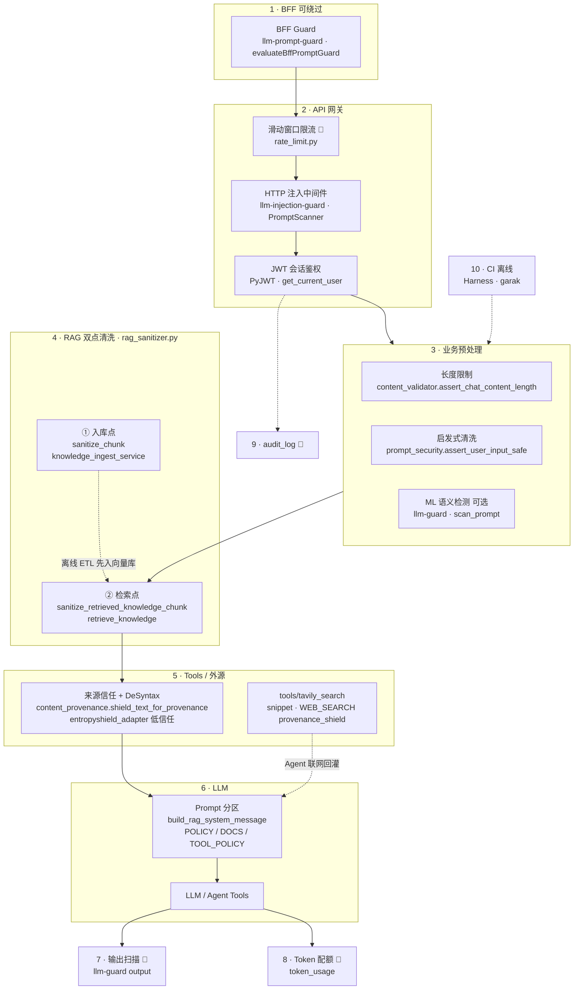
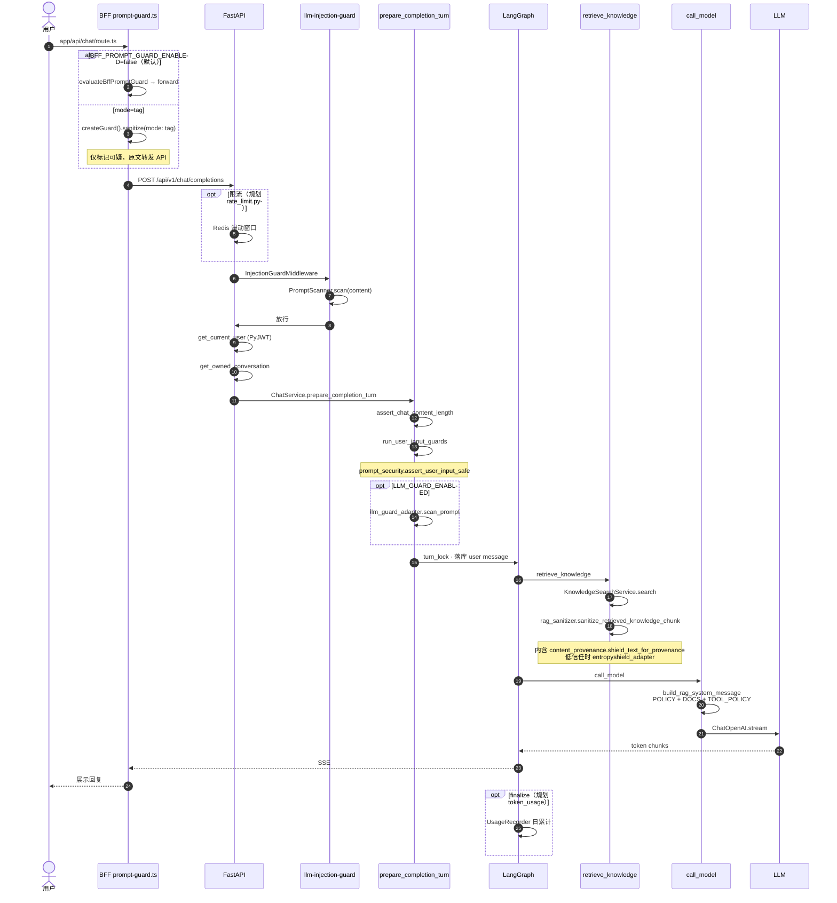
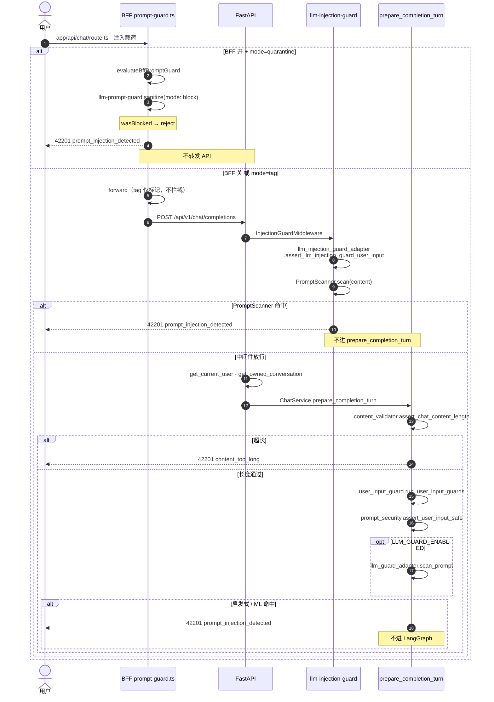

> **说明**：本文是 MemoryOS **聊天 / RAG 安全实现对照**，与 [《LLM 聊天与 RAG 安全怎么落地》](/chat-security.html) 互补——那一篇讲方法论，本篇讲**本系统在哪一层、用什么包、防什么、还缺什么**。  
> **回顾顺序**：第二节总表 → 第三节分层图 → 第四节时序图

<!--more-->

## 一、防护总表（主索引）

下表为全文核心：**防护模块名 = 业务称呼（第三方包 / 自研模块 / 规划组件）**。

| 流量分层 | 防护模块（包 / 代码） | 精确部署位置 | 执行时机 | 实现方案 | 抵御攻击 | 设计理由 | 优先级 | 依赖成本 | 短板 | 配套互补 | 风险提示 |
|:---------|:----------------------|:-------------|:---------|:---------|:---------|:---------|:-------|:---------|:-----|:---------|:---------|
| 1. 前端 / BFF（可绕过） | **BFF Guard**（[`llm-prompt-guard`](https://www.npmjs.com/package/llm-prompt-guard) · `apps/web/lib/prompt-guard.ts`） | Next BFF：`app/api/chat/**` 转发 API 前 | 用户点发送，body 未到 FastAPI | `createGuard().sanitize`；`tag` 仅标记转发 / `quarantine` 高危英文 422 | 直白英文 / 中文基础 Prompt 注入；简单角色劫持句式；少量带空格换行拆分的简易越狱指令；无编码、无字符变形的基础攻击载荷 | 早反馈、减无效 API 请求；**非权威** | P2 | npm 零后端依赖 | 直连 API 完全绕过 | `llm-injection-guard` 中间件、`prompt_security` | 不可作唯一注入防护 |
| 2. API 网关层 | **滑动窗口限流**（规划 · Redis 自研 · `rate_limit.py`） | 统一入口：`/auth/login`、`/chat/completions`、`/demo-turn` | HTTP 进入、鉴权**之前** | Redis 滑动窗口 → `429` `code=42901` | HTTP 层 DoS；高频批量刷对话；恶意脚本短时间大量新建会话；批量长对话消耗 GPU / 算力；恶意批量请求拉高服务成本 | 注入防住仍可能被高频烧算力 | P0 | Redis 计数 | 慢速低频渗透注入 | Token 日配额、`audit_log` | 全路由强制，无豁免 |
| 2. API 网关层 | **HTTP 注入中间件**（[`llm-injection-guard`](https://pypi.org/project/llm-injection-guard/) · `middleware/injection_guard.py` + `llm_injection_guard_adapter.py`） | FastAPI `InjectionGuardMiddleware`；仅 `POST /api/v1/chat/completions` | Body 解析后、路由 handler **之前** | `PromptScanner`（包内规则引擎，非自研正则） | 中英文指令覆盖 / 角色劫持；Base64 / 十六进制 / URL 编码伪装注入；零宽空格、RTL 方向控制隐形字符绕过；伪造 `<system>` 分隔标签；长换行填充稀释系统规则；基础 RAG 埋毒短句载荷 | 服务端第一层统一校验，弥补 BFF 可绕过 | P0 | 纯内存 + 轻量 pip | 多语种语义诱导、字符变体 | `prompt_security`、`llm-guard` | 所有 chat 请求必经；与启发式对照实验 |
| 2. API 网关层 | **JWT 会话鉴权**（[`PyJWT`](https://pyjwt.readthedocs.io/) · `core/deps.py` `get_current_user`） | 全部受保护路由 `Depends(get_current_user)` | 限流 / 中间件之后 | JWT 校验 + `get_owned_conversation` owner 绑定 | 窃取 Token 越权访问他人对话；未登录调用受保护聊天接口；篡改会话归属读取他人知识库；盗用他人账号批量发起对话 | 隔离用户数据边界 | P0 | 内存解析；会话 PG | 不防注入、DoS | 限流、审计 | 公开 demo 路由单独降级 |
| 3. 业务预处理层 | **长度 + 启发式清洗**（自研 · `content_validator.py` + `prompt_security.py` + `injection_patterns.py`；编排 `user_input_guard.py`） | `ChatService.prepare_completion_turn` | 进 LangGraph **之前**；`regenerate` 另校验 DB 末条 user | `CHAT_MAX_CONTENT_CHARS` 截断拒绝；EN/ZH override 短语 → 422 `prompt_injection_detected` | 上万字符超长文本淹没顶层 System 规则；中英文标准忽略 / 无视类劫持句式；分段拆分的多层叠加注入；基础全角字母汉字变形攻击；直白诱导泄露配置、系统提示词的恶意提问 | **权威**业务层硬拦截 | P0 | 纯字符串 / 正则 | 变形字符、小语种语义诱导 | `llm-guard`、`llm-injection-guard` | 所有 LLM 对话统一经 `prepare_completion_turn` |
| 3. 业务预处理层 | **LLM-Guard ML 语义检测**（[`llm-guard`](https://github.com/protectai/llm-guard) · `llm_guard_adapter.py`） | `user_input_guard` 链尾部（启发式之后） | 构造 Prompt 前 | `PromptInjection` + `InvisibleText` scanners | 日韩 / 泰 / 越等小语种注入；同义词改写、转述类诱导越狱；长篇故事叙事式隐性劫持；花体 / 下标 / 数学兼容字符变体绕过正则；无明显关键词纯语义诱导；混合多语言拼接注入载荷 | 补正则固定句式短板 | P3 | 可选 pip + HF/Torch，延迟↑ | 极简单字符注入（上层已拦） | `prompt_security`、DeSyntax | 性能敏感可关；高安全环境再开 |
| 4. RAG 全链路层 | **RAG 双点清洗**（自研 · `rag_sanitizer.py`） | ① `knowledge_ingest_service` ETL 入库 ② `graphs/nodes/retrieve.py` 检索后 | 入向量库前；拼进 `<DOCS>` 前 | NFKC、控制字符、劫持短语 neutralize、`RAG_CHUNK_MAX_CHARS` | 知识库文档预埋劫持指令间接注入；文档内嵌零宽隐形字符伪装攻击；超长分片稀释模型安全规则；全角 / Unicode 兼容字符埋毒；文档内伪造系统区块标签污染上下文 | 源头净化 + 漏网二次清洗 | P1 | 纯字符串 | 完整祈使句法埋毒 | `entropyshield`、`content_provenance` | ETL + retrieve **同一模块** |
| 5. Tools / 外源层 | **来源信任 + DeSyntax**（自研 `content_provenance.py` + [`entropyshield`](https://pypi.org/project/entropyshield/) · `entropyshield_adapter.py`） | `tavily_search.py` snippet 出口；`crawler-*` collection retrieve | 外源数据进 RAG 链**之前** | `worldcup-*` → `TRUSTED_ETL` 跳过；`WEB_SEARCH` / `CRAWLER` → `shield_text_for_provenance` | 爬虫、联网搜索结果预埋埋毒指令；外网不可信来源祈使句劫持；多语种外网文档间接注入；完整动词-宾语命令句法链攻击；低信任数据源拼接绕过内层正则过滤 | 外网不可信；破碎指令句法 | P1 | 可选 pip；纯算法 | 纯语义类**用户**输入攻击 | `rag_sanitizer`、`llm-guard` | 仅内网可信库可关 DeSyntax |
| 6. LLM 模型层 | **Prompt 分区隔离**（自研模板 · `graphs/prompts/rag_chat.py`、`unified_react.py` · `call_model.py`） | 每次 `call_model` 拼 `SystemMessage` | 调 Ollama / OpenAI 兼容 API 前 | `<POLICY>` + `<DOCS>` + `<TOOL_POLICY>`；用户仅 `HumanMessage` | 用户 / 文档内容伪造 System 分区边界；把 RAG 检索资料、工具返回内容识别为顶层系统指令；多轮对话上下文拼接混淆规则优先级；区块标签篡改引发角色劫持 | 多层漏检时模型侧软兜底 | P0 | 模板拼接 | 不防输出泄露 system | 输出扫描、PII 脱敏 | 分区规则不在前端暴露 |
| 7. LLM 输出后置层 | **输出扫描 / canary**（规划 · [`llm-guard`](https://github.com/protectai/llm-guard) output scanners + 自研 canary） | `ChatService` finalize 或流式拼接完成点 | 模型生成结束、落库 / SSE 结束前 | Output scanners；敏感形态正则；XSS 转义（FE） | system 泄露、密钥外带、PII、XSS | 只防输入不够 | P2 | 可选 HF 模型 | 不防输入侧注入 | Prompt 分区、`audit_log` | 流式宜分段校验 |
| 8. 计费管控层 | **Token 日配额**（规划 · `token_usage` 表 + `token_quota_service.py`） | `chat` 流式 finalize | 单次对话完成统计 usage | 按 `user_id` + UTC 日聚合 → `429` `code=42902` | 恶意构造超长篇对话疯狂消耗 token；单人单日无限次长对话拉高云账单；批量生成高上下文会话耗尽算力额度；低频但单轮超大 token 滥用成本 | 限流管次数，配额管 token 总量 | P0 | Redis / PG | 不防注入、越权 | 网关限流、审计 | 测试 / 生产阈值分离 |
| 9. 审计追溯层 | **安全审计日志**（规划 · `audit_log` 表 · `rate-limit-audit.md`） | login 失败、demo-turn、敏感删改 handler | 敏感操作同步写入 | PG `audit_log`：user、action、摘要、风险标记 | 事后追溯、合规取证 | 防护失效时复盘攻击路径 | P0 | DB IO 轻微 | 仅事后，不实时阻断 | 全模块埋点 | 合规硬性要求 |
| 10. CI 离线层 | **Harness 契约测试**（pytest · `tests/harness/test_chat_security_contract.py`） | PR / `pnpm test:api:harness` | 合并前 CI | 正例足球问 + 合成注入 → 断言 422 / 200 | 迭代修改清洗规则后防护逻辑退化；接口入参变更绕过注入拦截；业务代码重构导致安全校验分支丢失；基础注入用例回归失效、契约校验漂移 | 比 Garak 轻、PR 必跑 | P1 | PG 测试库 | 不覆盖全量载荷 | Garak、单元测试 | 不能替代运行时多层防护 |
| 10. CI 离线层 | **Garak 红队探针**（[`garak`](https://github.com/NVIDIA/garak) · `scripts/security/garak_probe.sh` · `pnpm security:garak`） | nightly / 发版前手动 | 非运行时 | `garak_memoryos.yaml`；可选 `garak_rest_chat.json` 打 live API | 迭代新增功能产生新型注入漏洞；正则 / 语义检测器漏检未知对抗载荷；多层防护组合存在串联绕过漏洞；线上真实流量无法覆盖的边缘攻击样本；OWASP LLM Top10 全类风险自动化扫描 | 线上流量覆盖不了的全量样本 | P2 | CI 算力；不占线上 | 不防实时 0day | Harness、Rubric（规划） | 离线验证，不替代运行时 |


### 规划扩展（尚未接入，备忘）


| 组件                            | 预期位置           | 用途                                 | 优先级 |
| ----------------------------- | -------------- | ---------------------------------- | --- |
| **IngressProfile**（EP13）      | BFF + API 共用配置 | 按 Agent / 路由分 Guard 策略，替代粗粒度全局 env | P3  |
| **Lakera Guard**（云 API）       | API 输入链        | 高检出托管检测；有预算再评估                     | P3  |
| **边缘 WAF**（CDN / Gateway）     | 公网入口           | 大规模 L3–L7 流量清洗                     | P3  |
| **日志脱敏**（LangSmith / app log） | 观测链路           | PII 采样与字段掩码                        | P3  |


### 包名与自研模块对照（速查）


| 业务称呼        | 第三方包（pip / npm）             | 自研代码入口                                               |
| ----------- | --------------------------- | ---------------------------------------------------- |
| BFF Guard   | `llm-prompt-guard`          | `apps/web/lib/prompt-guard.ts`                       |
| HTTP 注入中间件  | `llm-injection-guard`       | `middleware/injection_guard.py`                      |
| 权威启发式       | —                           | `prompt_security.py` · `user_input_guard.py`         |
| ML 输入扫描     | `llm-guard`（optional extra） | `llm_guard_adapter.py`                               |
| RAG 清洗      | —                           | `rag_sanitizer.py`                                   |
| 外源 DeSyntax | `entropyshield`（optional）   | `content_provenance.py` · `entropyshield_adapter.py` |
| Prompt 分区   | —                           | `rag_chat.py` · `call_model.py`                      |
| 红队          | `garak`（optional）           | `scripts/security/garak_probe.sh`                    |


---

## 二、分层架构图

节点命名与主表一致：**业务模块 · 方法 / 部署点**（同一 `rag_sanitizer.py` 在两个时机各调一个函数，不是两个独立组件）。



**读图提示**

| 图上节点 | 对应主表行 | 说明 |
|:---------|:-----------|:-----|
| ① `sanitize_chunk` | RAG 双点清洗 | 仅 **ETL 入库**；运行时 Chat 不经过此节点 |
| ② `sanitize_retrieved_knowledge_chunk` | RAG 双点清洗 | **retrieve 后**进 `<DOCS>` 前；内部会再调 `shield_text_for_provenance` |
| `content_provenance` + `entropyshield` | 来源信任 + DeSyntax | ② 与 tools 共用；`worldcup-*` 可信源跳过 DeSyntax |
| `tools/tavily_search` | 来源信任 + DeSyntax | `_format_tavily_response` 对每个 snippet 调 `shield_text_for_provenance(WEB_SEARCH)` |


---

## 三、时序图

### 3.1 主路径（Chat · 正常放行）

主路径前提：**BFF 未开**，或 **BFF 开且 `mode=tag`**（仅扫描标记后转发）。`quarantine` 命中会在 BFF 直接 422，不进 API，见 3.2。




### 3.2 拒绝路径（注入 · 任一层 422）

与 3.1 同一请求，但在 **BFF / HTTP 中间件 / prepare** 任一处被拦。三层互斥递进，不是并行扫描。

| 拦截层 | 主表模块 | 方法 | 响应 |
|:-------|:---------|:-----|:-----|
| BFF（仅 quarantine） | BFF Guard · `llm-prompt-guard` | `evaluateBffPromptGuard` → `sanitize(mode: block)` | 422 `prompt_injection_detected` |
| API 入口 | HTTP 注入中间件 · `llm-injection-guard` | `assert_llm_injection_guard_user_input` → `PromptScanner.scan` | 422 `prompt_injection_detected` |
| 业务预处理 | 长度 + 启发式 · 自研 | `assert_chat_content_length` / `assert_user_input_safe` | 422 `content_too_long` 或 `prompt_injection_detected` |
| 业务预处理（可选） | LLM-Guard · `llm-guard` | `llm_guard_adapter.scan_prompt` | 422 `prompt_injection_detected` |



**读图提示**：`mode=tag` 时 BFF **不会** 422，拒绝发生在 API 侧；直连 API（绕过 BFF）时从第 11 步 `InjectionGuardMiddleware` 起判。

### 3.3 离线路径（CI · 非运行时）

与 3.1 / 3.2 热路径无关；对应主表 **Harness 契约测试**、**Garak 红队探针** 两行。

```mermaid
sequenceDiagram
  autonumber
  participant CI as CI / 开发者
  participant H as Harness 契约
  participant A as FastAPI test client
  participant G as Garak 红队

  CI->>H: pnpm test:api:harness
  H->>H: pytest tests/harness/test_chat_security_contract.py

  H->>A: test_chat_football_analysis_passes_injection_filter
  Note over A: 正例足球问句 → 200 SSE start
  A-->>H: assert 200 · event=start

  H->>A: test_chat_rejects_prompt_injection_before_stream
  Note over A: 反例 ignore previous instructions…
  A->>A: InjectionGuardMiddleware · PromptScanner
  Note over A: 或 prepare · assert_user_input_safe
  A-->>H: assert 42201 prompt_injection_detected<br/>messages 未落库

  opt GARAK_PROBE_ENABLED=true（默认关 · nightly）
    CI->>G: pnpm security:garak
    G->>G: scripts/security/garak_probe.sh
    G->>G: garak --config garak_memoryos.yaml<br/>probe_spec: promptinject
    opt GARAK_TARGET_TYPE=rest
      G->>A: garak_rest_chat.json · live API
    else mock（默认）
      G->>G: 离线 mock target 冒烟
    end
    G-->>CI: 报告落盘 .garak/reports<br/>exit 0 非阻塞
  end
```

| 步骤 | 主表模块 | 包 / 脚本 | 说明 |
|:-----|:---------|:----------|:-----|
| Harness PR 门禁 | Harness 契约测试 | `test_chat_security_contract.py` | 正例 + 反例；**合并前必跑** |
| Garak nightly | Garak 红队探针 | `garak` · `garak_probe.sh` | 全量探针回归；**默认关**，失败不挡 PR |


---

## 四、Chat vs Demo 路径


| 路径        | 用户自由文本   | BFF `llm-prompt-guard` | API 注入链                                   |
| --------- | -------- | ---------------------- | ----------------------------------------- |
| Chat      | 是        | 可选                     | `llm-injection-guard` + `prompt_security` |
| Demo 分析按钮 | 否（服务端模板） | **否**                  | 仅参数 / 长度，不扫自由文本                           |


---

## 五、落地顺序（从总表提炼）

1. **P0 🔲**：限流 + Token 配额 + 审计（滥用三角，与注入正交）
2. **P1**：RAG 双点 ✅；外源链路生产开 `ENTROPYSHIELD_ENABLED`；Harness 保持 PR 门禁
3. **P2**：BFF 按需开；输出扫描；Garak live API 模板
4. **P3**：`LLM_GUARD_ENABLED`；IngressProfile / 云 Guard / WAF

---

## 六、小结


| 问题      | 结论                                  |
| ------- | ----------------------------------- |
| 信息太分散？  | **以第一节总表为唯一主索引**；图与时序是总表的视图。        |
| 命名对不上包？ | 总表「防护模块」列已写 **npm/pip 包名 + 仓库路径**。  |
| 还没做的写哪？ | 模块名标「规划」；见「规划扩展」与第五节落地顺序。 |


## 参考

- 工程文档：`memoryOS/docs/tech/chat-security.md`、`rate-limit-audit.md`
- 姊妹文：[LLM 聊天与 RAG 安全怎么落地？](/chat-security.html)

