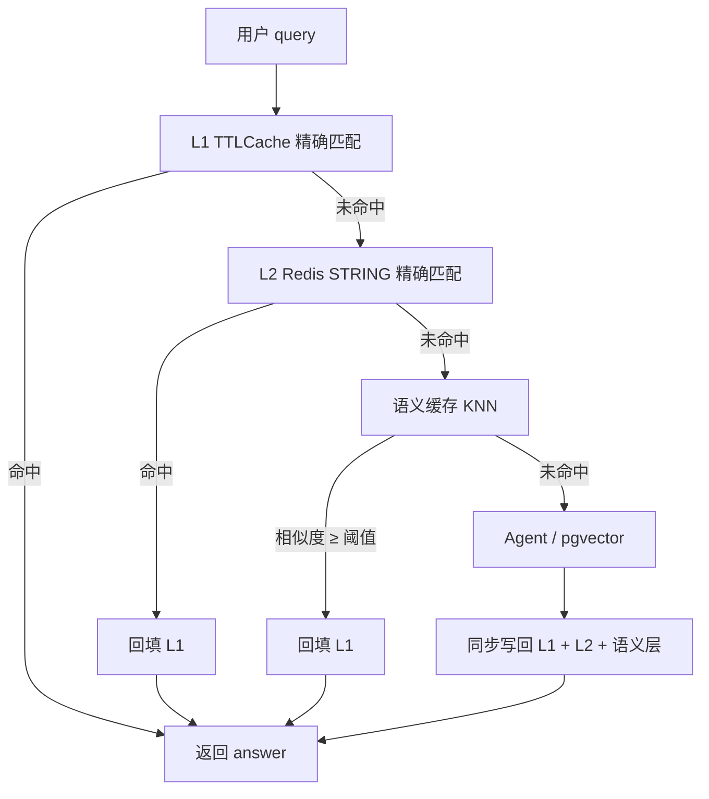

> 一套能扛住高并发的语义缓存，是怎么从「玩具」一步步长成「企业级」的。

---

## 一、为什么 RAG 系统需要多层缓存？

RAG 系统的响应链路通常是：Query →（可选）向量检索 → Agent / LLM 推理 → 生成答案。这一过程少则 2～3 秒，多则 5～10 秒，且每次调用都伴随着 Token 成本。

但真实流量里，大量请求是重复或高度相似的。比如很多人问「梅西在世界杯进了几个球」，每次都查 pgvector、调 Agent、跑 LLM，既浪费钱也浪费时间。

**缓存用来拦截这些重复计算。** 命中时响应可从秒级降到毫秒级，Token 消耗可降为 0。

---

## 二、多层缓存架构：一张流程图看懂全貌



三层职责：

| 层级 | 技术形态 | 匹配方式 | 特点 |
| :--- | :--- | :--- | :--- |
| **L1** | 进程内 `TTLCache` | query 文本完全一致（归一化后） | 最快，仅本进程有效 |
| **L2** | Redis `STRING` | 与 L1 相同的精确匹配 | 跨实例共享，毫秒级 |
| **语义缓存** | Redis Stack（RediSearch 向量索引） | embedding 相似度 ≥ 阈值 | 解决「表述不同、意思相近」 |

**两个容易忽略的实现细节：**

1. **L2 / 语义命中后必须回填 L1**，否则同进程下一次相同请求仍会走网络。
2. **写回应在请求链路末尾同步完成**（可用 Redis `pipeline` 把 L2 精确键与语义 Hash 放在一次提交里），避免「精确缓存写成功、向量索引写失败」导致长期不一致。

有 `history` 的多轮对话一般应 **跳过缓存**，避免把上一轮上下文误当成可复用答案。

---

## 三、本地开发：两条路径，别混为一谈

### 路径 A：极简原型（ChromaDB + 本地 Embedding）

适合第一次理解「语义缓存」概念，依赖最少：

| 组件 | 选型 | 说明 |
| :--- | :--- | :--- |
| L1 | `TTLCache` | 如 maxsize=100、ttl=60s |
| L2 | Redis 单机 | 精确 Key-Value |
| 语义层 | ChromaDB 嵌入式 | 本地文件，小规模够用 |
| Embedding | `all-MiniLM-L6-v2` | 384 维，可完全离线 |

注意：ChromaDB 返回的是 **distance**，需与集合的 `distance` 度量（如 cosine / L2）对齐后再和阈值比较；下面示例按 **cosine distance** 理解（越小越相似）：

```python
import chromadb
from sentence_transformers import SentenceTransformer

class SemanticCache:
    def __init__(self):
        self.client = chromadb.PersistentClient(path="./chroma_data")
        self.collection = self.client.get_or_create_collection(
            "semantic_cache",
            metadata={"hnsw:space": "cosine"},
        )
        self.embedder = SentenceTransformer("all-MiniLM-L6-v2")

    def get(self, query: str, threshold: float = 0.85):
        vec = self.embedder.encode(query).tolist()
        results = self.collection.query(
            query_embeddings=[vec],
            n_results=1,
            include=["documents", "metadatas", "distances"],
        )
        if not results["distances"] or not results["distances"][0]:
            return None
        distance = results["distances"][0][0]
        similarity = 1 - distance  # cosine space
        if similarity >= threshold:
            return results["metadatas"][0][0].get("answer")
        return None
```

原稿示例只返回 `documents[0][0]`（存的是 query 文本），且未说明 distance 含义，容易误用。

### 路径 B：与生产同构的本地栈（推荐）

在 **worldcup-rag** 等工程里，本地已直接用 **Redis Stack** 扛 L2 + 语义层，避免「本地 Chroma、线上 Redis」双套代码：

| 组件 | 选型 | 说明 |
| :--- | :--- | :--- |
| L1 | `TTLCache` | 参数放 `config.yaml`（如 maxsize=100、ttl=60s） |
| L2 | Redis `STRING` | Key：`exact:{MD5(query)}`；Value：JSON（含 `query` 原文 + `answer`，便于排查） |
| 语义层 | Redis Stack + **HNSW** | `FT.SEARCH` KNN；阈值从配置读取（如 0.88～0.95） |
| Embedding | 与线上一致 | 如 DashScope `text-embedding-v4`、1024 维，与 pgvector 对齐 |

**L2 精确缓存示例：**

```python
import hashlib, json

def exact_key(query: str) -> str:
    digest = hashlib.md5(query.strip().encode()).hexdigest()
    return f"exact:{digest}"

payload = {"query": query, "answer": answer, "workflow": "simple_qa"}
redis.setex(exact_key(query), ttl_l2, json.dumps(payload, ensure_ascii=False))
```

**语义缓存（Redis Stack + HNSW）要点：**

```python
import struct
from redis.commands.search.field import TextField, VectorField
from redis.commands.search.indexDefinition import IndexDefinition, IndexType

dim = 1024  # 与 Embedding 模型一致
client.ft("worldcup:semantic").create_index(
    [
        TextField("query"),
        TextField("answer"),
        VectorField(
            "embedding",
            "HNSW",
            {
                "TYPE": "FLOAT32",
                "DIM": dim,
                "DISTANCE_METRIC": "COSINE",
                "M": 16,
                "EF_CONSTRUCTION": 200,
            },
        ),
    ],
    definition=IndexDefinition(prefix=["sem:"], index_type=IndexType.HASH),
)

# KNN：返回的 distance 是余弦距离，相似度 = 1 - distance
blob = struct.pack(f"{len(vec)}f", *vec)
q = Query("*=>[KNN 3 @embedding $vec AS distance]").sort_by("distance").dialect(2)
result = client.ft("worldcup:semantic").search(q, query_params={"vec": blob})
if result.docs and (1 - float(result.docs[0].distance)) >= threshold:
    return result.docs[0].answer
```

索引算法在 **建索引时** 选定：`HNSW`（近似、快）或 `FLAT`（暴力精确）。更换算法需删索引重建。

---

## 四、企业版：浓缩版上线后会遇到什么？

| 挑战 | 本地常见问题 | 企业版常见解法 |
| :--- | :--- | :--- |
| **高并发** | 单机 Redis 连接数、CPU 成为瓶颈 | Redis Cluster / 代理 + 连接池 |
| **持久化** | 仅 Docker volume，无异地备份 | RDB + AOF，定期冷备 |
| **内存增长** | 缓存条目无限堆积 | `maxmemory-policy allkeys-lru` 等 |
| **语义检索性能** | Chroma 小规模尚可，上万条变慢 | Redis Stack HNSW，十万级向量仍可毫秒级 KNN |
| **缓存穿透** | 「查不到」仍每次打穿到 Agent | 缓存 `NULL_RESULT`（短 TTL，如 10 分钟） |
| **缓存雪崩** | 固定 TTL 同时过期 | TTL + 随机抖动 |
| **热 Key** | 无热点识别 | 滑动窗口 / 只缓存 Top N 热点 |
| **多实例 L1** | 各实例 L1 不一致 | L1 TTL 短、以 L2 为一致性来源 |

穿透防护示例：Agent 仍找不到答案时，写入 `answer: "NULL_RESULT"`，`ttl=600`，下次相同 query 直接短路，不再消耗 Token。

---

## 五、本地 vs 企业：横向对比

| 维度 | 本地（Chroma 极简栈） | 本地（Redis Stack 同构栈） | 企业生产版 |
| :--- | :--- | :--- | :--- |
| **L1** | TTLCache 100 / 60s | TTLCache，可配置 | Caffeine 等，W-TinyLFU |
| **L2** | 单机 Redis | 单机 Redis Stack | Redis Cluster |
| **语义检索** | ChromaDB | Redis Stack HNSW | Redis Stack / 专用向量库 |
| **Embedding** | 本地 384 维 | 与线上一致（如 1024 维） | 与线上一致 |
| **穿透防护** | 通常未做 | `NULL_RESULT` + 短 TTL | + 布隆过滤器 |
| **监控** | 手工统计 | `/cache/stats`、结构化日志 | Prometheus + Grafana |

---

## 六、怎么验收缓存真的生效？

用固定 Golden Case 跑 **两遍**：

1. **第一遍**：缓存为空，走 Agent（预热写回）。
2. **第二遍**：应几乎全部命中缓存，延迟显著下降（如 5s → 0.01s），且 **答案与第一遍一致**。

同时关注：

- **命中率**：`(L1 + L2 + Semantic) / 总请求`，本地联调期望 > 60%，生产热点场景期望 > 80%。
- **语义误判率**：相似但答非所问；若 > 5%，可提高阈值（如 0.88 → 0.95）或换 Embedding。

---

## 七、总结：演进不是推翻重来，而是逐层加固

本地版与企业版的 **查询顺序与回写逻辑一致**：L1 → L2 精确 → 语义 KNN → RAG，命中则回填 L1，未命中则写回各层。

差异在「护甲」：L1 容量与淘汰策略、L2 集群与高可用、语义层从嵌入式库升级为带 HNSW 的 Redis Stack（或专用向量服务）、再加上穿透/雪崩/监控。

**实践建议：** 逻辑用一套 `QueryCache` 抽象，参数进 `config.yaml`；本地可直接 Redis Stack 同构部署，避免 Chroma → Redis 迁移时重写语义层。这样开发阶段不被架构拖垮，流量上涨时主要换配置和基础设施，而不是换代码路径。
