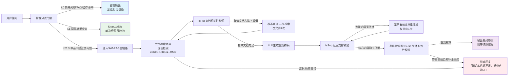

做企业级RAG的团队，几乎都被「幻觉」困扰过：财务场景说错报销标准、法律场景漏了合同条款、技术场景记错参数配置，哪怕优化了分块、换了Embedding、加了重排，依然没法彻底杜绝事实性错误。

Self-RAG（自反思检索增强生成）的出现，给「抑制幻觉」提供了全新的思路——让大模型自己校验自己，边生成边核对依据。但论文里的完整闭环好看不好用，微调门槛高、循环延迟大、全量上线成本翻倍，直接照搬必然踩坑。

本文先快速拆解核心原理，再重点讲企业如何做裁剪、搭架构、落地执行，给出可直接复用的实战流程图与落地方案。

## 一、Self-RAG核心原理快速拆解：三个「质检员」的闭环
### 1. 传统RAG的天生缺陷
标准RAG是线性开环架构：`用户提问 → 检索文档 → LLM生成 → 直接输出`。全程没有任何回头校验的机制：文档无关？内容无依据？答案答非所问？系统完全不知道，只会一股脑输出给用户，幻觉和错误自然无法避免。

### 2. 三大核心校验节点（一张表讲透）
Self-RAG的核心，就是在生成全流程里加入三次自检，相当于三个质检员层层把关，对应论文里的三类反思令牌。

| 节点标识 | 中文名称 | 核心作用 | 执行时机 | 核心价值 | 固有局限 |
|----------|----------|----------|----------|----------|----------|
| IsRel | 文档相关性校验 | 判断检索到的文档和用户问题是否真的相关，过滤掉「语义相似但答非所问」的噪声文档 | 检索完成后，生成答案前 | 提前剔除无关上下文，减少干扰信息，降低LLM被误导的概率 | 只能判断相关性，不能判断内容本身的准确性 |
| IsSup | 证据支撑校验 | 逐句核对生成的内容，是否能从检索文档中找到原文依据，识别并剔除凭空编造的内容 | 答案生成过程中/初稿生成后 | 从根源抑制事实性幻觉，保证每一条结论都有原文可溯源 | 逐句校验开销大，长文本生成耗时明显增加 |
| IsUse | 整体有效性校验 | 全局判断最终答案是否完整解决了用户的问题，有没有答非所问、信息残缺、逻辑矛盾 | 完整答案生成后 | 兜底把关，避免输出无效、错误的答案，保证最终交付质量 | 全局判断粒度粗，无法定位具体哪句话有问题 |

### 3. 论文原版的理想闭环
论文原生Self-RAG是一个完整的循环闭环：
> 用户提问 → 判定是否需要检索 → 召回文档 → IsRel校验（不相关则重检索）→ 生成答案片段 → IsSup校验（无依据则重检索/重写）→ 生成完整答案 → IsUse校验（无效则重写）→ 输出最终答案

这个设计在实验室里效果拉满，但放到企业生产环境，处处都是工程陷阱。

## 二、论文版 vs 企业版：为什么不能直接照搬？
原生Self-RAG的设计完全没有考虑工程约束，和企业生产的要求存在本质矛盾。

| 对比维度 | 论文理想版 | 企业生产要求 | 核心矛盾 |
|----------|------------|--------------|----------|
| 模型依赖 | 必须微调基础大模型，内置反思令牌 | 优先复用现有模型，支持闭源API，尽量零微调 | 微调门槛高，90%企业不具备条件 |
| 循环机制 | 无限循环，不达标就一直重检索重写 | 严格限制迭代次数，必须有熔断机制 | 无限循环会导致延迟失控、算力雪崩 |
| 成本控制 | 不考虑Token开销，追求效果最优 | 严格控制成本，简单问题不走复杂流程 | 全量上Self-RAG成本直接翻2-3倍 |
| 延迟要求 | 无SLA约束，可接受长耗时 | 有明确响应时间要求，普通问答1秒内返回 | 多轮校验+重检索会让延迟上涨50%以上 |
| 运维可观测性 | 黑盒判断，逻辑全在模型内部 | 必须全链路埋点，可排查、可调试、可优化 | 黑盒自检出了问题找不到根因，迭代困难 |

结论很明确：**企业落地Self-RAG，必须做裁剪、做分层、做工程化改造，抓核心价值，弃理想化设计。**

## 三、企业级Self-RAG落地架构：分层裁剪，可控可用
### 1. 核心设计原则
企业落地Self-RAG，始终围绕四个原则：
- **分层分流**：高风险场景用全量校验，低风险场景走轻量化路径，不搞一刀切；
- **轻量化实现**：优先用Prompt拆分实现校验，不盲目追求微调，降低落地门槛；
- **可管可控**：必须有熔断机制、全链路埋点，保证服务稳定、问题可排查；
- **复用底座**：不推翻现有RAG体系，在原有检索、重排底座上叠加质检能力。

### 2. 完整实战流程图
以下是可直接落地的企业级Self-RAG全链路流程图，覆盖从用户提问到最终输出的完整分支与熔断逻辑。



### 3. 核心模块逐解
#### （1）前置分流门禁：把80%的流量挡在Self-RAG外
这是控制成本、保证延迟的核心，分为两层，覆盖绝大多数场景：
- **第一层：规则硬路由（零LLM开销，覆盖70%-80%流量）**
  靠关键词、正则、元数据直接分流，毫秒级完成判断：
  - 闲聊、问候、常识类问题 → 走L0直答，不检索不校验；
  - 命中高频FAQ缓存 → 直接返回缓存结果；
  - 带明确单据号、工号、时间的单条件查询 → 走L1快RAG，仅检索不校验；
  - 命中「报销标准、合同条款、合规要求、金额规则」等高风险关键词 → 进入Self-RAG主链路。

- **第二层：轻量模型精分（处理边界模糊问题）**
  规则判断不了的模糊问题，用小型分类模型（7B参数以内即可）做意图分类，输出三档：`无需检索 / 快速检索 / 深度自检`，分发到对应流水线。

#### （2）共享检索底座：复用现有能力，不重复造轮子
Self-RAG是「质检层」，不是「检索层」。你现有的RAG能力全部可以复用：
- 混合检索（BM25关键词 + 稠密向量）；
- RRF多路结果融合；
- CrossEncoder重排精筛；
- MMR多样性去重。

Self-RAG的IsRel校验，是在重排之后做**二次语义过滤**，把重排都没拦住的「伪相关」文档剔除掉，而不是替代原有检索优化。

#### （3）自检校验层：轻量化Prompt实现，不用微调
90%的企业场景，都不需要微调模型，把三个校验拆成独立的LLM调用节点，写专属Prompt就能达到80%以上的效果，且完全可控、可调试。

核心Prompt示例（可直接复用）：
- **IsRel 文档相关性校验**
  ```
  角色：文档相关性审核员
  任务：判断给定的参考文档，是否能直接回答用户的问题。
  要求：
  1. 仅输出「相关」或「不相关」，不要任何解释；
  2. 只有文档内容能直接支撑问题答案，才算相关；语义接近但答非所问，算不相关。
  
  用户问题：{query}
  参考文档：{doc_content}
  ```

- **IsSup 证据支撑校验**
  ```
  角色：事实准确性审核员
  任务：判断待校验句子，是否完全能从参考文档中找到原文依据，没有编造、引申、篡改。
  要求：
  1. 仅输出「有依据」或「无依据」，不要任何解释；
  2. 句子里的数字、规则、名称必须和原文完全一致，合理推断也算无依据。
  
  待校验句子：{sentence}
  参考文档：{all_docs}
  ```

- **IsUse 整体有效性校验**
  ```
  角色：答案质量审核员
  任务：判断生成的答案是否完整、准确地解决了用户的问题，没有答非所问、信息缺失、逻辑错误。
  要求：仅输出「有效」或「无效」，不要任何解释。
  
  用户问题：{query}
  生成答案：{answer}
  ```

#### （4）熔断与回流机制：严格限制循环，杜绝雪崩
必须给所有回流逻辑加上硬约束，绝对不允许无限循环：
- **重检索次数上限：1次**。IsRel判断文档无效时，仅允许改写一次查询词重新检索，第二次仍无效直接兜底；
- **重生成次数上限：1次**。IsSup判断无依据时，仅允许基于现有文档重写一次，不触发新的检索；
- **全局超时控制**：单条请求总耗时超过阈值（比如2秒），直接中断校验，返回标准RAG结果，保证SLA。

## 四、分步落地实操：从0到1搭建可用的Self-RAG
不用追求一步到位，按五步循序渐进，风险最低、收益最快。

### 步骤1：先夯实基线RAG底座
Self-RAG是锦上添花，不是雪中送炭。如果基线检索准确率太低，再怎么校验也没用。
落地前先保证基线达标：
- 分块策略适配业务场景，Chunk大小、重叠率调优完成；
- 混合检索 + ReRank重排已上线，召回Top10准确率不低于70%；
- 基础的权限、审计、溯源能力完备。

### 步骤2：搭建前置分流门禁
先做第一层规则路由，这一步投入最小，收益最大：
1. 梳理业务场景，划分「低风险/中风险/高风险」三类；
2. 写正则/关键词规则，把高占比的简单问题分流出去；
3. 接入高频缓存，Top20的常见问题直接走缓存，不消耗检索和生成资源。

完成这一步，你会发现**70%以上的流量根本不需要Self-RAG**，整体成本反而会下降。

### 步骤3：先落地IsRel，再逐步叠加校验
不要一上来就开三层校验，从易到难逐步叠加：
1. **第一阶段：上线IsRel文档过滤**
   在现有检索+重排之后，加一层IsRel校验，剔除无关文档。这一步实现最简单，能直接减少上下文噪声，幻觉率能下降30%左右。

2. **第二阶段：高风险场景加IsSup证据校验**
   只在财务、法律、合规等高风险场景开启IsSup，普通场景不开。优先校验答案里的数字、规则、名称等关键信息，不用逐句全量校验，平衡效果和开销。

3. **第三阶段：极端重要场景加IsUse兜底**
   只有面向高管、合规审计的特殊场景，才开启IsUse全局校验，做最终兜底把关。

### 步骤4：配置熔断与监控埋点
上线前必须补齐工程能力：
1. 给每个校验节点加超时控制，单节点超时直接跳过，不阻塞主流程；
2. 全链路埋点，统计每个节点的通过率、耗时、误判率，方便后续优化；
3. 配置降级开关：Self-RAG服务异常时，自动切回标准RAG，保证业务不中断。

### 步骤5：按业务场景分层配置，动态调整
最终形成分层配置表，不同场景用不同的自检强度：

| 业务风险等级 | 典型场景 | 检索模式 | 校验节点 | 重检索权限 |
|--------------|----------|----------|----------|------------|
| 低风险 | 普通知识问答、FAQ、产品介绍 | 快RAG | 无 | 否 |
| 中风险 | 业务流程、制度查询、普通技术文档 | 标准RAG | IsRel | 否 |
| 高风险 | 财务报销标准、合同条款、合规规则、数据统计 | 深度RAG | IsRel + IsSup | 允许1次 |
| 极高风险 | 审计报告、法律意见书、官方对外答复 | 深度RAG+人工复核 | IsRel + IsSup + IsUse | 允许1次 |

## 五、真实落地案例：制造企业财务报销RAG升级
### 背景
珠三角某中型电子制造企业，全员3000+人，原有标准RAG系统服务报销咨询，存在三个核心痛点：
1. 幻觉率18.2%，经常说错报销标准、审批流程，财务日均接10+纠错电话；
2. 所有请求都走完整检索+重排，高峰期延迟超标，每月API费用高；
3. 简单FAQ占比高，却和复杂问题走一样的流程，资源浪费严重。

### 落地方案
基于原有RAG底座，做轻量化Self-RAG改造，全程没有微调模型：
1. **前置两层分流**：规则+小模型分类，72%的FAQ简单问题走缓存直答，18%的简单查询走快RAG，仅10%的高风险问题进入Self-RAG链路；
2. **分层校验**：普通报销咨询开IsRel，报销标准、审批流程等高风险场景加开IsSup，年度汇总类场景再加IsUse；
3. **严格熔断**：仅允许1次二次检索，超时自动降级为标准RAG；
4. **全量复用底座**：原有混合检索、RRF、BGE重排全部保留，Self-RAG仅做后置质检。

### 落地效果
| 指标 | 改造前 | 改造后 | 变化 |
|------|--------|--------|------|
| 事实幻觉率 | 18.2% | 3.7% | 下降79.7% |
| 平均响应延迟 | 1.2s | 0.9s | 下降25% |
| 月均API成本 | 基准值 | 下降35% | 成本不升反降 |
| 财务纠错电话量 | 日均10+ | 日均1-2个 | 减少80%+ |

核心原因：大部分简单流量走了低成本快路径，节省的算力完全覆盖了自检增加的开销，实现了「效果提升、成本下降」的双赢。

## 六、企业落地避坑指南：最容易踩的5个坑
### 1. 上来就全量上Self-RAG，不分流
这是最常见的错误：所有请求都走三层校验，结果就是延迟暴涨、成本翻倍，而大部分简单问题根本不需要自检。
**正确做法**：先做分流，只给20%不到的高风险场景开Self-RAG。

### 2. 执着于微调模型，忽略Prompt版性价比
很多团队一上来就想微调模型，觉得原生版效果最好。但实际上，Prompt版自检能达到微调版80%以上的效果，成本和门槛却只有十分之一。
**正确做法**：先用Prompt版跑通业务、验证价值，真的有瓶颈了再考虑微调。

### 3. 不做熔断，无限循环拖垮服务
没有熔断机制的Self-RAG就是生产事故隐患——遇到极端问题，模型反复判定「信息不足」，循环检索生成，直接把GPU/API额度打满，拖垮整个服务。
**正确做法**：硬编码最大循环次数，全局超时控制，永远留好降级兜底方案。

### 4. 用Self-RAG替代检索优化，本末倒置
有些团队觉得有了Self-RAG，检索就不用优化了，反正有质检把关。这是完全错误的：检索是源头，源头召回的都是垃圾，再怎么质检也没用。
**正确做法**：先把检索基线做好，Self-RAG是锦上添花，不是救命稻草。

### 5. 不做埋点监控，出问题无法排查
如果自检逻辑全是黑盒，出了幻觉你根本不知道是IsRel漏了、还是IsSup没查出来，想优化都无从下手。
**正确做法**：每个校验节点都打日志，记录判断结果、耗时、误判案例，定期复盘优化Prompt和策略。

## 最后总结
Self-RAG的本质，是给RAG系统加上一道「质量安全阀」，它的核心价值是「抑制幻觉、可溯源、控风险」，而不是追求学术上的完美闭环。

对企业来说，落地技术永远要做减法：抓住核心价值，砍掉不实用的设计，结合业务场景分层使用，用最小的投入换最大的收益。先夯实基线、再做分流、逐步叠加自检能力，才是最稳妥、性价比最高的落地路径。
